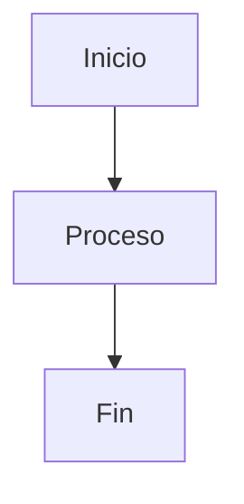
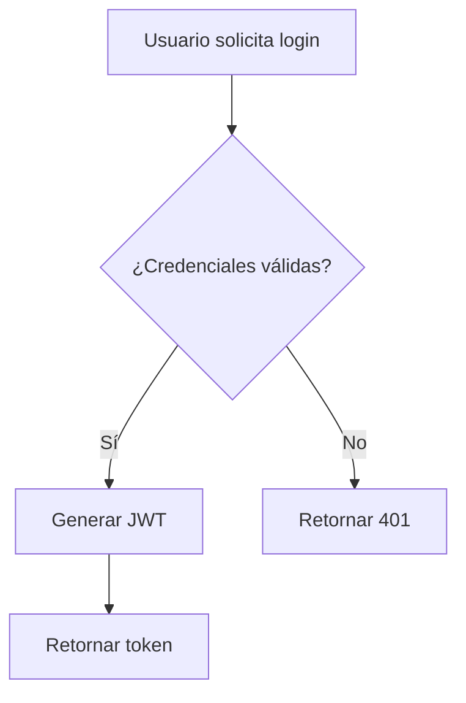
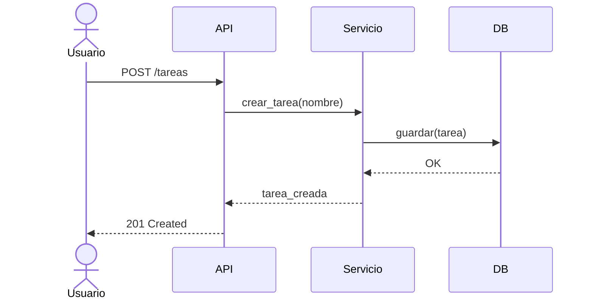
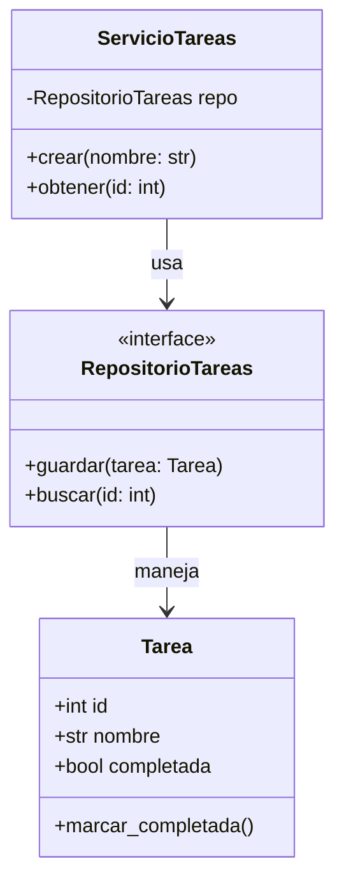
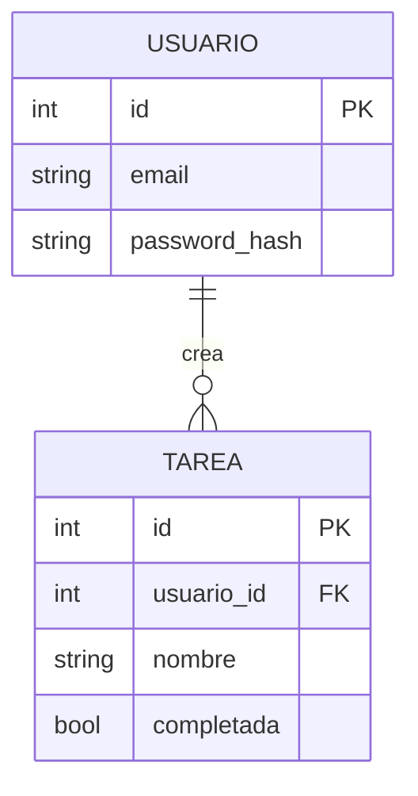
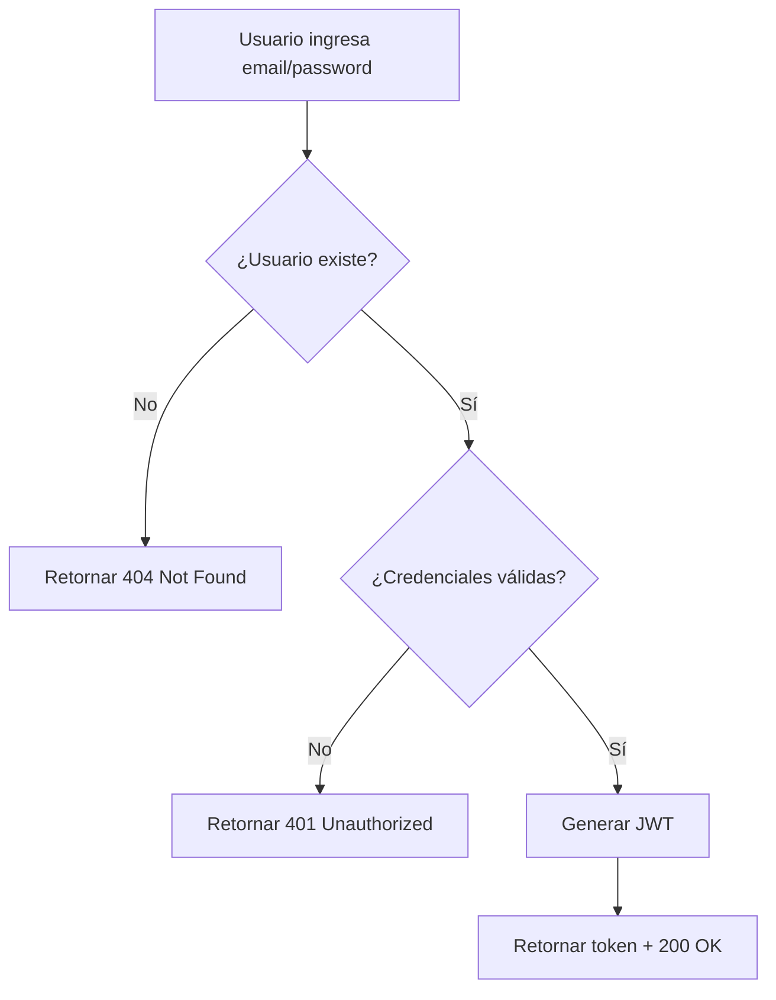
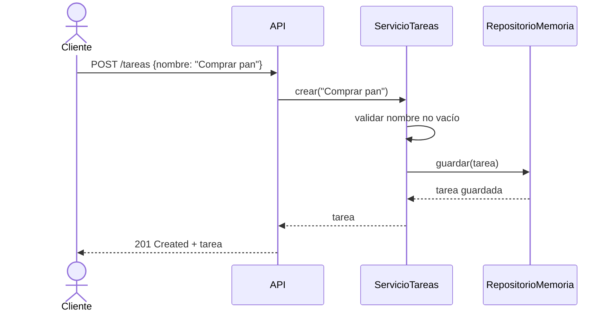
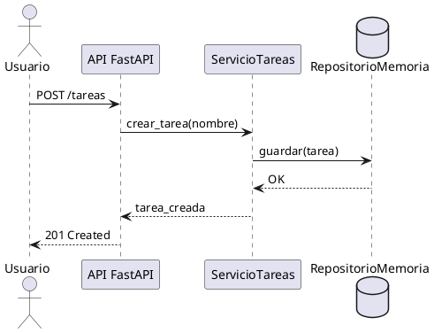
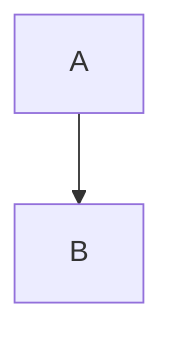

# Clase 3 - Documentación y Pensamiento Estructurado

**Duración**: 6 horas
**Objetivo**: Dominar documentación técnica profesional con Markdown, diagramas, ADRs, y usar IA para generar y mejorar documentación de forma estructurada.

---

## Índice

1. [Conceptos Clave](#1-conceptos-clave-30-min)
2. [Markdown Avanzado](#2-markdown-avanzado-1h)
3. [Diagramas con IA](#3-diagramas-con-ia-mermaid-plantuml-15h)
4. [Architecture Decision Records (ADRs)](#4-architecture-decision-records-adrs-1h)
5. [Documentación Automática con IA](#5-documentación-automática-con-ia-1h)
6. [Proyecto Final](#6-proyecto-final-documentar-módulo-0-1h)
7. [Evaluación y Entregables](#7-evaluación-y-entregables)

---

## 1. Conceptos Clave (30 min)

### 1.1 ¿Por qué Documentar es Crítico?

**Escenario real**: Tienes 3 proyectos simultáneos:
- Proyecto A: Sin documentación
- Proyecto B: README genérico ("Este es un proyecto de...")
- Proyecto C: Documentación completa (README, ADRs, diagramas, ejemplos)

**Pregunta**: ¿Cuál puedes retomar después de 3 meses sin tocar?

**Respuesta**: Solo el Proyecto C. Los otros dos requieren horas de "arqueología de código" para entender qué hace y por qué.

---

### 1.2 La Documentación Como Pensamiento Estructurado

**Concepto**: Escribir documentación NO es solo para otros, es para **estructurar tu propio pensamiento**.

**Analogía**: Un arquitecto no construye un edificio sin planos. Un desarrollador no debería construir software sin documentación.

**Pattern de pensamiento estructurado**:

```
1. ¿QUÉ hace este sistema? (README - Overview)
2. ¿POR QUÉ tomé esta decisión? (ADRs - Decision Records)
3. ¿CÓMO funciona? (Diagramas - Architecture)
4. ¿CÓMO se usa? (Ejemplos - Usage)
```

---

### 1.3 IA Como Asistente de Documentación

**IA NO reemplaza tu pensamiento estructurado**, pero SÍ puede:

✅ Generar plantillas de documentación
✅ Crear diagramas Mermaid/PlantUML desde descripciones
✅ Mejorar claridad de texto
✅ Traducir documentación técnica
✅ Generar tablas de contenido

❌ NO puede: Explicar decisiones de arquitectura que tú no documentaste
❌ NO puede: Saber por qué elegiste X tecnología vs Y

**Regla de oro**: Si no puedes explicarlo a IA con claridad, probablemente no lo entiendes completamente.

---

## 2. Markdown Avanzado (1h)

### 2.1 Instalación de Herramientas (15 min)

**Opción 1: Visual Studio Code (Recomendado)**

Ya tienes VS Code instalado (o Cursor, que es un fork de VS Code). Instala extensiones:

1. Abre VS Code
2. Ve a Extensions (Ctrl+Shift+X / Cmd+Shift+X)
3. Busca e instala:
   - **Markdown All in One** (yzhang.markdown-all-in-one)
   - **Markdown Preview Mermaid** (bierner.markdown-mermaid)
   - **Markdownlint** (DavidAnson.vscode-markdownlint)

**Opción 2: Obsidian (Opcional - para nota-taking)**

Si quieres una herramienta dedicada para documentación:

```bash
# Windows: Descargar desde https://obsidian.md/download
# macOS:
brew install --cask obsidian

# Linux:
# Descargar AppImage desde https://obsidian.md/download
```

**Verificación**:

Crea un archivo `test.md` con:

```markdown
# Test

- Item 1
- Item 2

**Bold** and *italic*
```

Abre en VS Code y presiona `Ctrl+K V` (Windows/Linux) o `Cmd+K V` (macOS) para ver preview.

---

### 2.2 Markdown Básico (Repaso Rápido - 10 min)

Si ya sabes Markdown básico, salta esto. Si no:

```markdown
# Título nivel 1
## Título nivel 2
### Título nivel 3

**Negrita** y *cursiva*

- Lista no ordenada
- Item 2

1. Lista ordenada
2. Item 2

[Link](https://ejemplo.com)


`código inline`

```python
# Bloque de código
def saludar():
    print("Hola")
```
```

---

### 2.3 Markdown Avanzado (35 min)

#### Tablas

```markdown
| Columna 1 | Columna 2 | Columna 3 |
|-----------|-----------|-----------|
| Dato 1    | Dato 2    | Dato 3    |
| Dato 4    | Dato 5    | Dato 6    |

# Con alineación
| Izquierda | Centro | Derecha |
|:----------|:------:|--------:|
| A         | B      | C       |
```

**Ejercicio**: Crea una tabla comparando Python vs JavaScript con 3 características.

---

#### Checkboxes (Task Lists)

```markdown
- [x] Tarea completada
- [ ] Tarea pendiente
- [ ] Otra tarea pendiente
```

**Uso real**: En GitHub Issues, estos checkboxes son interactivos.

---

#### Bloques de Código con Syntax Highlighting

```markdown
```python
def fibonacci(n):
    if n <= 1:
        return n
    return fibonacci(n-1) + fibonacci(n-2)
```

```javascript
function factorial(n) {
    return n <= 1 ? 1 : n * factorial(n - 1);
}
```

```bash
git commit -m "feat: add fibonacci function"
```
```

**Tip**: Especifica siempre el lenguaje después de ``` para syntax highlighting.

---

#### Callouts (GitHub-Flavored Markdown)

```markdown
> **Note**
> Esto es una nota informativa.

> **Warning**
> Esto es una advertencia importante.

> **Important**
> Información crítica que no debe ignorarse.
```

**Renderiza como**:
> **Note**
> Esto es una nota informativa.

---

#### Detalles Colapsables (HTML en Markdown)

```markdown
<details>
<summary>Click para expandir</summary>

Este contenido está oculto hasta que el usuario haga click.

```python
def ejemplo():
    print("Código oculto")
```

</details>
```

**Uso real**: En READMEs largos, ocultar secciones avanzadas o logs de error.

---

#### Anclas (Links Internos)

```markdown
# Índice
- [Sección 1](#sección-1)
- [Sección 2](#sección-2)

## Sección 1
Contenido...

## Sección 2
Contenido...
```

**Regla**: Los IDs se generan automáticamente desde títulos, en minúsculas, espacios → guiones.

---

### 2.4 Ejercicio: README Profesional (Manual)

**Tarea**: Crea un `README.md` para un proyecto ficticio "API de Tareas".

**Estructura mínima**:

```markdown
# API de Tareas

Breve descripción (1-2 líneas).

## Características

- [ ] CRUD de tareas
- [ ] Autenticación JWT
- [ ] Base de datos PostgreSQL

## Instalación

```bash
# Paso 1
# Paso 2
```

## Uso

Ejemplo de código...

## Tecnologías

| Tecnología | Versión |
|------------|---------|
| Python     | 3.12    |
| FastAPI    | 0.118   |

## Contribuir

Instrucciones...

## Licencia

MIT
```

**Tiempo**: 15 min

**Validación**: ¿Otra persona puede entender QUÉ hace y CÓMO instalarlo en <2 min?

---

## 3. Diagramas con IA (Mermaid, PlantUML) (1.5h)

### 3.1 ¿Por qué Diagramas en Código?

**Problema**: Diagramas en herramientas visuales (Draw.io, Lucidchart):
- ❌ No versionables con Git
- ❌ Se desactualizan rápido
- ❌ Requieren exportar imágenes

**Solución**: Diagramas como código (Mermaid, PlantUML):
- ✅ Versionables con Git
- ✅ Se actualizan con el código
- ✅ Renderizados automáticamente en GitHub/GitLab

---

### 3.2 Mermaid - Instalación y Setup (10 min)

**Mermaid** ya funciona en GitHub/GitLab sin instalación adicional.

**Para preview local en VS Code**:

Ya instalaste la extensión "Markdown Preview Mermaid" en la sección 2.1.

**Verificación**:

Crea `diagrama-test.md`:

```markdown
# Test Mermaid


```

Abre con preview (Ctrl+K V) y deberías ver el diagrama renderizado.

---

### 3.3 Mermaid - Tipos de Diagramas (30 min)

#### Flowchart (Diagramas de Flujo)



**Sintaxis**:
- `graph TD` = Top-Down (vertical)
- `graph LR` = Left-Right (horizontal)
- `[Texto]` = Rectángulo
- `{Texto}` = Rombo (decisión)
- `-->` = Flecha

**Ejercicio**: Crea un flowchart del proceso de "Crear una tarea".

---

#### Sequence Diagram (Diagramas de Secuencia)



**Uso**: Perfecto para documentar flujos de API.

**Ejercicio**: Diagrama de secuencia para autenticación JWT.

---

#### Class Diagram (Diagramas de Clases)



**Uso**: Documentar arquitectura de clases (SOLID, Dependency Inversion).

---

#### Entity Relationship Diagram (Diagramas de DB)



**Uso**: Diseño de bases de datos.

---

### 3.4 IA para Generar Diagramas (30 min)

**Pattern**: Descripción en lenguaje natural → IA genera Mermaid → Tú validas

**Ejemplo 1: Flowchart con Claude Code**

```bash
claude "Genera un diagrama Mermaid flowchart para este proceso:
1. Usuario ingresa email y password
2. Sistema valida credenciales
3. Si válidas, genera JWT y retorna
4. Si inválidas, retorna error 401
5. Si usuario no existe, retorna 404"
```

**IA genera**:



**Tu trabajo**: Validar que el diagrama es correcto.

---

**Ejemplo 2: Sequence Diagram**

```bash
claude "Genera un diagrama Mermaid de secuencia para:
- Cliente llama POST /tareas con {nombre: 'Comprar pan'}
- API recibe request
- API llama a ServicioTareas.crear()
- Servicio valida que nombre no esté vacío
- Servicio llama a RepositorioMemoria.guardar()
- Repositorio guarda en memoria
- Respuesta retorna hasta cliente con 201 Created"
```

**IA genera**:



---

**Ejemplo 3: Class Diagram**

```bash
claude "Genera un diagrama Mermaid de clases para:
- Clase Tarea con atributos: id (int), nombre (str), completada (bool)
- Clase ServicioTareas con método crear(nombre: str) -> Tarea
- Clase RepositorioMemoria con método guardar(tarea: Tarea) -> None
- ServicioTareas depende de RepositorioMemoria
- Ambos manejan objetos Tarea"
```

**IA genera** (código Mermaid similar al ejemplo anterior).

---

### 3.5 PlantUML (Opcional - 20 min)

**PlantUML** es más potente que Mermaid pero requiere Java.

**Instalación** (opcional):

```bash
# macOS
brew install plantuml

# Windows (con Chocolatey)
choco install plantuml

# Linux
sudo apt install plantuml
```

**Ejemplo de diagrama PlantUML**:



**Cuándo usar PlantUML vs Mermaid**:
- **Mermaid**: Más simple, funciona en GitHub sin setup, suficiente para 90% casos
- **PlantUML**: Más potente, mejor para diagramas complejos (UML detallado)

**Recomendación**: Usa Mermaid por defecto, PlantUML solo si Mermaid no es suficiente.

---

### 3.6 Ejercicio: Documenta tu Arquitectura con Diagramas

**Tarea**: Crea un archivo `ARCHITECTURE.md` con:

1. **Class Diagram**: Muestra la arquitectura de 3 capas (API → Servicio → Repositorio)
2. **Sequence Diagram**: Flujo de crear una tarea desde el cliente hasta la base de datos
3. **Flowchart**: Proceso de validación de una tarea antes de guardarla

**Tiempo**: 30 min

**Validación**: ¿Otra persona puede entender la arquitectura en <5 min viendo los diagramas?

---

## 4. Architecture Decision Records (ADRs) (1h)

### 4.1 ¿Qué son los ADRs? (15 min)

**Definición**: Un ADR es un documento que captura una **decisión arquitectónica importante** con su contexto y consecuencias.

**Problema que resuelven**:

**Escenario sin ADRs**:
```
Desarrollador nuevo: "¿Por qué usamos FastAPI en vez de Flask?"
Desarrollador senior: "Mmm, creo que fue por async... o tal vez performance... no recuerdo"
```

**Escenario con ADRs**:
```
Desarrollador nuevo: "¿Por qué usamos FastAPI?"
Desarrollador senior: "Lee ADR-002-elegir-framework-web.md"
```

**ADR captura**:
1. **¿Qué decisión se tomó?** (Usar FastAPI)
2. **¿Por qué?** (Async nativo, validación con Pydantic, performance)
3. **¿Qué alternativas consideramos?** (Flask, Django)
4. **¿Qué trade-offs aceptamos?** (Menor comunidad que Flask, más nuevo)

---

### 4.2 Formato de un ADR (20 min)

**Template básico**:

```markdown
# ADR-001: [Título de la Decisión]

## Estado
[Propuesto | Aceptado | Rechazado | Deprecado | Superseded por ADR-XXX]

## Contexto
¿Qué problema estamos resolviendo? ¿Qué restricciones tenemos?

## Decisión
¿Qué decidimos hacer?

## Alternativas Consideradas
- Opción A: ...
- Opción B: ...
- Opción C: ...

## Consecuencias
### Positivas
- Beneficio 1
- Beneficio 2

### Negativas
- Trade-off 1
- Trade-off 2

## Notas
Información adicional, links, referencias.

---
**Fecha**: YYYY-MM-DD
**Autores**: Nombre(s)
```

---

### 4.3 Ejemplo de ADR Real (15 min)

**ADR-001: Usar FastAPI como Framework Web**

```markdown
# ADR-001: Usar FastAPI como Framework Web

## Estado
Aceptado

## Contexto
Necesitamos un framework web para construir una API REST de gestión de tareas.

**Requisitos**:
- Debe soportar async/await (futuras integraciones con I/O intensivo)
- Validación automática de requests/responses
- Documentación automática (OpenAPI/Swagger)
- Performance alta (100+ req/s esperados)
- Comunidad activa y buena documentación

**Restricciones**:
- Python 3.12
- Equipo sin experiencia previa en frameworks async (necesita curva de aprendizaje corta)

## Decisión
Usaremos **FastAPI 0.118.0** como framework web.

## Alternativas Consideradas

### 1. Flask
**Pros**:
- Comunidad muy grande
- Mucha experiencia en el equipo
- Simple y flexible

**Contras**:
- No async nativo (requiere extensiones)
- Validación manual (o extensiones como Flask-Pydantic)
- Sin documentación automática nativa

### 2. Django + Django REST Framework
**Pros**:
- Framework completo (ORM, admin, auth incluidos)
- Muy maduro y estable

**Contras**:
- Demasiado pesado para una API simple
- Async limitado (solo desde Django 4+)
- Curva de aprendizaje más alta

### 3. FastAPI
**Pros**:
- Async nativo
- Validación automática con Pydantic
- Documentación automática (Swagger UI)
- Performance excelente (comparable a Node.js/Go)
- Type hints nativos (mejor DX con IDE)

**Contras**:
- Comunidad más pequeña que Flask
- Framework más nuevo (menos recursos legacy)

## Decisión Justificada

Elegimos FastAPI porque:
1. Requisito de async es crítico para escalar
2. Validación con Pydantic reduce bugs en producción
3. Documentación automática acelera desarrollo frontend
4. Performance es mejor que Flask/Django

## Consecuencias

### Positivas
- Desarrollo más rápido (validación + docs automáticas)
- Código más mantenible (type hints)
- Performance alta desde día 1
- Curva de aprendizaje aceptable (sintaxis similar a Flask)

### Negativas
- Menor cantidad de recursos/tutoriales que Flask
- Equipo necesita aprender async/await
- Algunas librerías de Flask no compatibles directamente

## Notas
- FastAPI usa Starlette (ASGI) y Pydantic internamente
- Documentación oficial: https://fastapi.tiangolo.com/
- Benchmarks: https://www.techempower.com/benchmarks/

---
**Fecha**: 2025-01-15
**Autores**: Equipo Backend
```

---

### 4.4 Cuándo Crear un ADR (10 min)

**Crea un ADR cuando**:

✅ Eliges una tecnología principal (framework, base de datos, librería core)
✅ Cambias arquitectura (monolito → microservicios, sync → async)
✅ Decisión afecta a múltiples partes del sistema
✅ Decisión es difícil de revertir (cambiar DB, cambiar lenguaje)
✅ Hay debate en el equipo sobre qué hacer

**NO creas un ADR para**:

❌ Decisiones triviales (naming de variables, formato de código)
❌ Decisiones fáciles de revertir (cambiar una librería pequeña)
❌ Implementación de features normales

**Regla práctica**: Si dentro de 6 meses alguien pregunta "¿Por qué hicimos esto?", necesitas un ADR.

---

### 4.5 IA para Generar ADRs (Asistente, no Autor) (10 min)

**IA puede ayudar con**:
- Generar template de ADR
- Listar alternativas comunes
- Redactar consecuencias

**IA NO puede**:
- Saber por qué TÚ elegiste X tecnología
- Conocer tus restricciones específicas
- Decidir por ti

---

**Prompt ejemplo**:

```bash
claude "Genera un template de ADR para decidir entre PostgreSQL, MySQL y MongoDB para una aplicación de e-commerce.

Contexto:
- Necesitamos almacenar productos, usuarios, órdenes
- Relaciones claras entre entidades (usuario tiene órdenes)
- Transacciones críticas (pago = orden + reducir inventario)
- Equipo tiene experiencia con SQL
- Budget limitado (open source preferido)"
```

**IA generará**:

```markdown
# ADR-002: Elegir Base de Datos para E-commerce

## Estado
Propuesto

## Contexto
[IA genera contexto basado en tu prompt]

## Decisión
[Placeholder - TÚ debes decidir]

## Alternativas Consideradas
### PostgreSQL
**Pros**:
- Transacciones ACID
- Relaciones fuertes (foreign keys)
- Open source
- JSON support si necesitamos flexibilidad

**Contras**:
- Más complejo que MySQL

### MySQL
**Pros**: ...
### MongoDB
**Pros**: ...

[IA genera comparación]

## Consecuencias
[IA sugiere consecuencias genéricas - TÚ debes personalizarlas]
```

**Tu trabajo**: Completar la decisión, validar alternativas, añadir contexto específico.

---

### 4.6 Ejercicio: Crea tu Primer ADR

**Tarea**: Crea `ADR-001-elegir-almacenamiento-tareas.md`

**Decisión**: ¿Usar RepositorioMemoria, RepositorioJSON o RepositorioDB?

**Contexto**:
- Es un proyecto de aprendizaje
- No hay usuarios reales (por ahora)
- Necesitas iterar rápido
- En el futuro podría crecer a producción

**Estructura**:
1. Contexto (requisitos, restricciones)
2. Alternativas (Memoria, JSON, DB con pros/contras)
3. Decisión (elige UNA)
4. Consecuencias (positivas/negativas)

**Tiempo**: 20 min

**Validación**: ¿Un developer nuevo puede entender POR QUÉ elegiste esto en <3 min?

---

## 5. Documentación Automática con IA (1h)

### 5.1 Generando README.md Profesional con IA (20 min)

**Patrón**: Código existente → IA analiza → README generado → Tú validas y mejoras

**Ejemplo práctico**:

Tienes este código (de Clase 1):

```python
# tareas.py
def agregar_tarea(lista, tarea):
    lista.append(tarea)
    print(f"✓ Tarea '{tarea}' agregada")

def listar_tareas(lista):
    if not lista:
        print("No hay tareas")
        return
    for i, tarea in enumerate(lista, 1):
        print(f"{i}. {tarea}")

def main():
    tareas = []
    while True:
        print("\n1. Agregar tarea")
        print("2. Listar tareas")
        print("3. Salir")
        opcion = input("Elige opción: ")
        # ... (lógica del menú)
```

**Prompt para IA**:

```bash
claude "Genera un README.md profesional para este proyecto.

Código:
[pegar código de tareas.py]

Incluye:
- Descripción breve
- Características
- Instalación (es Python puro, sin dependencias)
- Uso (cómo ejecutar)
- Ejemplo de output
- Autor y licencia (MIT)"
```

**IA genera**:

```markdown
# Gestor de Tareas CLI

Aplicación de línea de comandos simple para gestionar una lista de tareas.

## Características

- ✅ Agregar tareas a la lista
- 📋 Listar todas las tareas
- 🚀 Sin dependencias externas (Python puro)

## Requisitos

- Python 3.8+

## Instalación

```bash
# Clonar repositorio
git clone https://github.com/tu-usuario/gestor-tareas.git
cd gestor-tareas

# No requiere instalación de dependencias
```

## Uso

```bash
python tareas.py
```

### Ejemplo de Sesión

```
1. Agregar tarea
2. Listar tareas
3. Salir
Elige opción: 1
Escribe la tarea: Comprar pan
✓ Tarea 'Comprar pan' agregada

1. Agregar tarea
2. Listar tareas
3. Salir
Elige opción: 2
1. Comprar pan
```

## Estructura del Proyecto

```
.
├── tareas.py       # Aplicación principal
└── README.md       # Este archivo
```

## Autor

Tu Nombre - [@tu-usuario](https://github.com/tu-usuario)

## Licencia

MIT - Ver LICENSE para más detalles
```

**Tu trabajo**:
1. Revisar que la descripción es correcta
2. Añadir capturas de pantalla si tienes
3. Personalizar secciones (autor, licencia)
4. Validar que los comandos funcionan

---

### 5.2 Generando Docstrings con IA (15 min)

**Patrón**: Función sin documentar → IA genera docstring → Tú validas

**Ejemplo**:

```python
# Código sin documentar
def crear_tarea(nombre: str, prioridad: str) -> dict:
    if not nombre:
        raise ValueError("Nombre vacío")
    if prioridad not in ["alta", "media", "baja"]:
        raise ValueError("Prioridad inválida")
    return {
        "id": generar_id(),
        "nombre": nombre,
        "prioridad": prioridad,
        "completada": False
    }
```

**Prompt para IA**:

```bash
claude "Genera docstrings en formato Google para esta función:

def crear_tarea(nombre: str, prioridad: str) -> dict:
    if not nombre:
        raise ValueError('Nombre vacío')
    if prioridad not in ['alta', 'media', 'baja']:
        raise ValueError('Prioridad inválida')
    return {
        'id': generar_id(),
        'nombre': nombre,
        'prioridad': prioridad,
        'completada': False
    }"
```

**IA genera**:

```python
def crear_tarea(nombre: str, prioridad: str) -> dict:
    """Crea una nueva tarea con nombre y prioridad especificados.

    Args:
        nombre (str): Nombre de la tarea. No puede estar vacío.
        prioridad (str): Prioridad de la tarea. Debe ser 'alta', 'media' o 'baja'.

    Returns:
        dict: Diccionario con la tarea creada conteniendo:
            - id (int): Identificador único
            - nombre (str): Nombre de la tarea
            - prioridad (str): Prioridad ('alta', 'media', 'baja')
            - completada (bool): Estado de completado (inicialmente False)

    Raises:
        ValueError: Si el nombre está vacío o la prioridad es inválida.

    Examples:
        >>> tarea = crear_tarea("Comprar pan", "alta")
        >>> tarea["nombre"]
        'Comprar pan'
        >>> tarea["prioridad"]
        'alta'
    """
    if not nombre:
        raise ValueError("Nombre vacío")
    if prioridad not in ["alta", "media", "baja"]:
        raise ValueError("Prioridad inválida")
    return {
        "id": generar_id(),
        "nombre": nombre,
        "prioridad": prioridad,
        "completada": False
    }
```

**Validación**:
- ✅ Args correctos
- ✅ Returns correctos
- ✅ Raises correctos
- ✅ Examples útiles

---

### 5.3 Generando API Documentation con FastAPI (15 min)

**FastAPI genera documentación automáticamente**, pero puedes mejorarla con descripciones.

**Código básico**:

```python
from fastapi import FastAPI

app = FastAPI()

@app.post("/tareas")
def crear_tarea(nombre: str, prioridad: str):
    # ...
    return {"id": 1, "nombre": nombre, "prioridad": prioridad}
```

**Documentación automática**: Ve a `http://localhost:8000/docs` después de ejecutar la API.

**Mejorando con descripciones**:

```python
from fastapi import FastAPI
from pydantic import BaseModel, Field

app = FastAPI(
    title="API de Tareas",
    description="API REST para gestionar tareas con prioridades",
    version="1.0.0"
)

class CrearTareaRequest(BaseModel):
    nombre: str = Field(..., min_length=1, max_length=100, description="Nombre de la tarea")
    prioridad: str = Field(..., pattern="^(alta|media|baja)$", description="Prioridad: alta, media o baja")

    class Config:
        json_schema_extra = {
            "example": {
                "nombre": "Comprar pan",
                "prioridad": "alta"
            }
        }

@app.post(
    "/tareas",
    summary="Crear nueva tarea",
    description="Crea una tarea con nombre y prioridad. Retorna la tarea creada con ID generado.",
    response_description="Tarea creada exitosamente"
)
def crear_tarea(cuerpo: CrearTareaRequest):
    """
    Endpoint para crear una nueva tarea.

    - **nombre**: Nombre descriptivo de la tarea (1-100 caracteres)
    - **prioridad**: Debe ser 'alta', 'media' o 'baja'

    Retorna la tarea creada con un ID único generado.
    """
    # ...
    return {"id": 1, "nombre": cuerpo.nombre, "prioridad": cuerpo.prioridad}
```

**Ahora en `/docs` verás**:
- Título y descripción de la API
- Descripción del endpoint
- Ejemplo de request
- Validaciones claras

---

**IA puede ayudar**:

```bash
claude "Genera descripciones para este endpoint de FastAPI:

@app.get('/tareas/{id}')
def obtener_tarea(id: int):
    # Busca tarea por ID, retorna 404 si no existe
    pass

Incluye:
- summary
- description
- response_description
- docstring completo"
```

---

### 5.4 Generando Diagramas desde Código con IA (10 min)

**Patrón**: Código existente → IA analiza → Diagrama Mermaid generado

**Ejemplo**:

```python
# api.py
from fastapi import FastAPI
from servicio_tareas import ServicioTareas
from repositorio_memoria import RepositorioMemoria

app = FastAPI()
servicio = ServicioTareas(RepositorioMemoria())

@app.post("/tareas")
def crear_tarea(nombre: str):
    return servicio.crear(nombre)

# servicio_tareas.py
class ServicioTareas:
    def __init__(self, repositorio):
        self._repo = repositorio

    def crear(self, nombre):
        tarea = {"nombre": nombre}
        self._repo.guardar(tarea)
        return tarea

# repositorio_memoria.py
class RepositorioMemoria:
    def __init__(self):
        self._tareas = []

    def guardar(self, tarea):
        self._tareas.append(tarea)
```

**Prompt para IA**:

```bash
claude "Genera un diagrama Mermaid de clases mostrando la arquitectura de este código:

[pegar código]

Muestra:
- API depende de ServicioTareas
- ServicioTareas depende de RepositorioMemoria
- Métodos principales de cada clase"
```

**IA genera diagrama Mermaid** (como los vistos en sección 3).

---

## 6. Proyecto Final: Documentar Módulo 0 (1h)

### 6.1 Objetivo

Crea documentación completa para TODO lo que has aprendido en Módulo 0 (Clases 1-3).

### 6.2 Estructura Requerida

Crea una carpeta `documentacion-modulo0/` con:

```
documentacion-modulo0/
├── README.md                 # Overview del módulo
├── ARCHITECTURE.md           # Diagramas de tu setup de desarrollo
├── ADR-001-herramientas.md   # Decisión de qué herramientas usar
├── ADR-002-workflow.md       # Decisión de workflow Git + IA
└── GUIA-RAPIDA.md            # Cheatsheet de comandos útiles
```

### 6.3 Requerimientos por Archivo

#### README.md

Debe incluir:
- **Descripción**: Qué aprendiste en Módulo 0 (3-5 líneas)
- **Objetivos de Aprendizaje**: Lista de skills adquiridos
- **Tecnologías**: Tabla con herramientas (Python, Git, Claude Code, Cursor)
- **Instalación**: Links a guías de instalación
- **Índice**: Links a otros documentos (ARCHITECTURE.md, ADRs, etc.)

---

#### ARCHITECTURE.md

Debe incluir:

1. **Diagrama de tu Setup de Desarrollo** (Mermaid flowchart):
   - Muestra: IDE (VS Code/Cursor) → Git → GitHub → Claude Code CLI
   - Incluye: Dónde escribes código, dónde guardas, cómo usas IA

2. **Diagrama de tu Workflow** (Mermaid sequence diagram):
   - Proceso: Tarea asignada → Escribir código → Usar IA para review → Commit → Push

3. **Explicación de cada componente**: 2-3 líneas por herramienta

---

#### ADR-001-herramientas.md

Decisión: ¿Qué herramientas IA usar (Claude Code CLI, Cursor, GitHub Copilot, ChatGPT)?

**Estructura**:
- Contexto: Necesitas IA assistant para desarrollo
- Alternativas: Claude Code, Cursor, Copilot, ChatGPT (pros/contras de cada uno)
- Decisión: Cuál(es) elegiste y por qué
- Consecuencias: Qué beneficios/limitaciones aceptas

---

#### ADR-002-workflow.md

Decisión: ¿Qué workflow Git usar (Git Flow, GitHub Flow, trunk-based)?

**Estructura**:
- Contexto: Necesitas un workflow para versionar código
- Alternativas: Git Flow, GitHub Flow, trunk-based
- Decisión: Cuál elegiste
- Consecuencias: Cómo afecta tu desarrollo diario

**Tip**: Para proyectos de aprendizaje, GitHub Flow (main + feature branches) suele ser suficiente.

---

#### GUIA-RAPIDA.md

Cheatsheet de comandos útiles. Incluye secciones:

**Git**:
```bash
# Crear branch
git checkout -b feat/nueva-feature

# Commit
git add .
git commit -m "feat: add feature"

# Push
git push origin feat/nueva-feature
```

**Claude Code CLI**:
```bash
# Generar código
claude "Crea una función que..."

# Revisar código
claude "Revisa este código en busca de bugs: [código]"

# Generar tests
claude "Genera tests para esta función: [código]"
```

**Markdown**:
```markdown
# Sintaxis común

**Negrita**
*Cursiva*
`código`

- Lista
- Items

[Link](url)
```

**Mermaid**:
```markdown

```

---

### 6.4 Uso de IA en el Proyecto

**Permitido**:
- ✅ Generar templates de documentos
- ✅ Generar diagramas Mermaid desde descripciones
- ✅ Mejorar redacción de textos
- ✅ Generar ejemplos de código para documentación

**NO permitido** (debes hacerlo manualmente):
- ❌ IA decide QUÉ herramientas usar (ADRs)
- ❌ IA inventa tu workflow (debe reflejar TU workflow real)
- ❌ IA escribe TODO sin que tú valides

**Regla**: IA asiste, TÚ decides y validas.

---

### 6.5 Criterios de Evaluación

| Criterio | Peso | Descripción |
|----------|------|-------------|
| **Completitud** | 30% | Todos los archivos presentes, todas las secciones completas |
| **Claridad** | 25% | Documentación clara, sin ambigüedades, fácil de seguir |
| **Diagramas** | 20% | Mínimo 2 diagramas Mermaid correctos y útiles |
| **ADRs** | 15% | ADRs con decisiones reales, alternativas, consecuencias |
| **Formato** | 10% | Markdown correcto, sin errores de sintaxis, bien formateado |

**Mínimo para aprobar**: 70/100

---

### 6.6 Entregable

**Formato**: Carpeta `documentacion-modulo0/` con todos los archivos.

**Commit**:
```bash
git add documentacion-modulo0/
git commit -m "docs: add complete documentation for Module 0"
git push origin main
```

**Validación final**: ¿Otra persona puede entender TODO lo que aprendiste en Módulo 0 leyendo esta documentación en <15 min?

---

## 7. Evaluación y Entregables

### 7.1 Entregables de la Clase

1. **README profesional** (Ejercicio 2.4) - 15%
2. **3 diagramas Mermaid** (Ejercicio 3.6) - 25%
3. **ADR de almacenamiento** (Ejercicio 4.6) - 20%
4. **Proyecto final** (Documentación Módulo 0) - 40%

**Mínimo para aprobar la clase**: 70/100

---

### 7.2 Autoevaluación

Responde honestamente:

- [ ] ¿Puedo crear un README profesional sin ayuda de IA?
- [ ] ¿Entiendo cómo funcionan los diagramas Mermaid?
- [ ] ¿Puedo usar IA para generar diagramas y validar que son correctos?
- [ ] ¿Sé cuándo crear un ADR y cuándo no?
- [ ] ¿Puedo escribir un ADR completo con contexto, alternativas, decisión y consecuencias?
- [ ] ¿Entiendo que IA asiste en documentación pero no decide por mí?

**Si respondiste NO a 2+ preguntas**: Repasa las secciones correspondientes.

---

### 7.3 Rúbrica Detallada del Proyecto Final

#### README.md (10 puntos)
- [ ] Descripción clara del módulo (2 pts)
- [ ] Objetivos de aprendizaje listados (2 pts)
- [ ] Tabla de tecnologías completa (2 pts)
- [ ] Índice con links funcionales (2 pts)
- [ ] Formato Markdown correcto (2 pts)

#### ARCHITECTURE.md (15 puntos)
- [ ] Diagrama de setup de desarrollo (5 pts)
- [ ] Diagrama de workflow (5 pts)
- [ ] Explicaciones claras de componentes (3 pts)
- [ ] Diagramas renderizados correctamente (2 pts)

#### ADR-001 y ADR-002 (15 puntos cada uno = 30 total)
- [ ] Contexto bien definido (4 pts)
- [ ] 3+ alternativas con pros/contras (6 pts)
- [ ] Decisión clara y justificada (3 pts)
- [ ] Consecuencias positivas/negativas (2 pts)

#### GUIA-RAPIDA.md (10 puntos)
- [ ] Sección Git con 5+ comandos (3 pts)
- [ ] Sección Claude Code con ejemplos (2 pts)
- [ ] Sección Markdown con sintaxis común (2 pts)
- [ ] Sección Mermaid con ejemplo (2 pts)
- [ ] Formato claro, fácil de copiar/pegar (1 pt)

#### Calidad General (10 puntos)
- [ ] Sin errores de Markdown (2 pts)
- [ ] Estructura de carpetas correcta (2 pts)
- [ ] Commit message siguiendo Conventional Commits (2 pts)
- [ ] Reflete TU aprendizaje real, no genérico (2 pts)
- [ ] Ortografía y gramática correctas (2 pts)

**Total**: 100 puntos

---

### 7.4 Recursos Adicionales

**Markdown**:
- [GitHub Flavored Markdown Spec](https://github.github.com/gfm/)
- [Markdown Guide](https://www.markdownguide.org/)
- [Markdown Cheatsheet](https://github.com/adam-p/markdown-here/wiki/Markdown-Cheatsheet)

**Mermaid**:
- [Documentación oficial](https://mermaid.js.org/)
- [Mermaid Live Editor](https://mermaid.live/) - Para probar diagramas
- [Ejemplos de diagramas](https://mermaid.js.org/ecosystem/integrations.html)

**ADRs**:
- [ADR GitHub Organization](https://adr.github.io/)
- [Template de ADR](https://github.com/joelparkerhenderson/architecture-decision-record)
- [Ejemplos de ADRs reales](https://github.com/arachne-framework/architecture)

**FastAPI Documentation**:
- [OpenAPI Schema](https://fastapi.tiangolo.com/tutorial/metadata/)
- [Response Models](https://fastapi.tiangolo.com/tutorial/response-model/)

---

## Resumen de la Clase

En esta clase aprendiste:

1. **Markdown Avanzado**: Tablas, callouts, detalles colapsables, anclas
2. **Diagramas como Código**: Mermaid (flowcharts, sequence, class, ER diagrams)
3. **ADRs**: Documentar decisiones arquitectónicas con contexto y consecuencias
4. **IA como Asistente de Documentación**: Generar READMEs, docstrings, diagramas
5. **Validación Crítica**: IA genera, TÚ validas y decides

**Skill clave**: Documentar pensamiento estructurado (QUÉ, POR QUÉ, CÓMO) usando herramientas modernas + IA como asistente.

**Próxima clase**: Clase 4 - Tu Primer Agente Custom (crear agentes educativos especializados).

---

**¿Preguntas?** Repasa las secciones donde tengas dudas. La documentación es una habilidad que mejora con práctica constante.

**Regla de oro para documentar**: Si dentro de 6 meses TÚ MISMO no puedes entender tu código/decisiones leyendo la documentación, entonces la documentación no es suficiente.

¡Documenta con IA, piensa con claridad!
