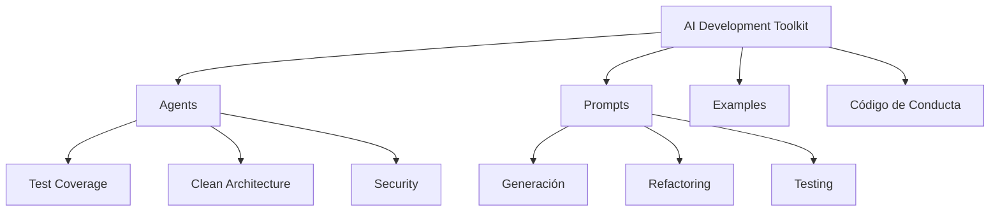
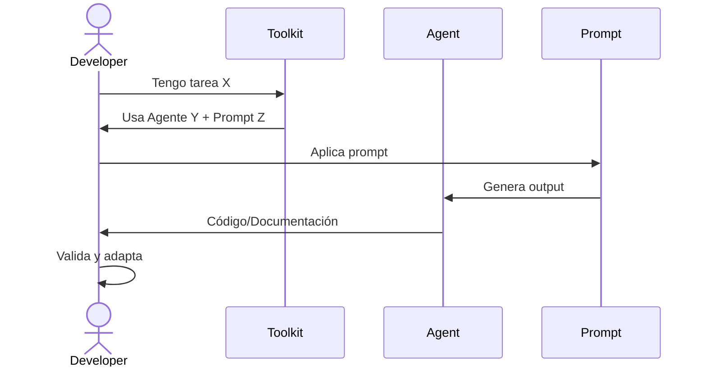

# Proyecto Final - Módulo 0: IA Development Foundations

**Duración estimada**: 8-10 horas
**Peso en nota final del módulo**: 40%

---

## Objetivo

Integrar TODO lo aprendido en Módulo 0 creando un **Portfolio de IA Development** que demuestre tu dominio de herramientas, documentación, agentes, prompt engineering, y desarrollo ético con IA.

**Entregable**: Repositorio completo en GitHub con documentación profesional, agentes custom, prompts reutilizables, y código de conducta.

---

## Contexto

Has completado 6 clases del Módulo 0:
1. Fundamentos de IA en Desarrollo
2. Git y Cursor con IA
3. Documentación y Pensamiento Estructurado
4. Tu Primer Agente Custom
5. Prompt Engineering Avanzado
6. Limitaciones y Ética

**Ahora demostrarás** que puedes usar IA como copiloto profesional.

---

## Descripción del Proyecto

Crearás un **repositorio "ai-development-toolkit"** que contenga:

1. **Documentación completa** (README, ARCHITECTURE, ADRs)
2. **Biblioteca de Agentes Educativos** (mínimo 6 agentes)
3. **Biblioteca de Prompts** (mínimo 15 prompts reutilizables)
4. **Código de Ejemplo** (implementación de feature con IA)
5. **Código de Conducta IA** (tu framework ético)
6. **Guía de Uso** (cómo otros pueden usar tu toolkit)

---

## Estructura del Repositorio

```
ai-development-toolkit/
├── README.md                           # Overview del toolkit
├── ARCHITECTURE.md                     # Diagramas de cómo usar el toolkit
├── docs/
│   ├── ADR-001-eleccion-agentes.md     # Por qué estos agentes
│   ├── ADR-002-estructura-prompts.md   # Por qué esta estructura
│   └── GUIA_RAPIDA.md                  # Cheatsheet de uso
├── agents/
│   ├── README.md                       # Catálogo de agentes
│   ├── test-coverage-strategist.md     # (Ya creado en Clase 4)
│   ├── clean-architecture-enforcer.md  # (Ya creado en Clase 4)
│   ├── git-commit-helper.md            # (Ya creado en Clase 4)
│   ├── security-hardening-mentor.md    # (Ya creado en Clase 4)
│   ├── refactoring-mentor.md           # (Tu agente de Clase 4)
│   └── [tu-agente-custom].md           # (Agente nuevo que diseñes)
├── prompts/
│   ├── README.md                       # Catálogo de prompts
│   ├── code-generation.md              # Prompts para generar código
│   ├── refactoring.md                  # Prompts para refactoring
│   ├── testing.md                      # Prompts para tests
│   ├── documentation.md                # Prompts para docs
│   └── debugging.md                    # Prompts para debugging
├── examples/
│   ├── README.md                       # Qué contiene examples/
│   ├── feature-con-ia/                 # Ejemplo completo
│   │   ├── README.md                   # Proceso de desarrollo
│   │   ├── api.py                      # Código implementado
│   │   ├── test_api.py                 # Tests
│   │   └── WORKFLOW.md                 # Workflow usado (agentes, prompts)
│   └── prompts-usados.md               # Prompts exactos que usaste
├── mi-codigo-conducta-ia.md            # (De Clase 6)
└── .gitignore                          # Git ignore completo
```

---

## Requisitos por Componente

### 1. README.md Principal (20 puntos)

Debe incluir:

**Secciones obligatorias**:
```markdown
# AI Development Toolkit

[Descripción del toolkit en 2-3 líneas]

## 🎯 Objetivo

[Para qué sirve este toolkit]

## 📚 Contenido

- [x] 6 Agentes Educativos Especializados
- [x] 15+ Prompts Reutilizables
- [x] Ejemplos de Uso en Proyectos Reales
- [x] Código de Conducta Ético

## 🚀 Quick Start

[Cómo empezar a usar el toolkit en 3 pasos]

## 📖 Documentación

- [Agentes](agents/README.md)
- [Prompts](prompts/README.md)
- [Ejemplos](examples/README.md)
- [Arquitectura](ARCHITECTURE.md)
- [ADRs](docs/)

## 🤝 Código de Conducta

[Link a mi-codigo-conducta-ia.md]

## 🛠️ Tecnologías

| Herramienta | Versión | Uso |
|-------------|---------|-----|
| Claude Code CLI | latest | Asistente principal |
| Python | 3.12 | Ejemplos de código |
| Git | 2.x | Control de versiones |

## 📝 Licencia

MIT

## ✍️ Autor

[Tu nombre] - [GitHub profile]
```

**Criterios**:
- [ ] Descripción clara del toolkit
- [ ] Contenido bien estructurado
- [ ] Quick Start útil
- [ ] Links funcionando
- [ ] Tabla de tecnologías completa
- [ ] Badges opcionales (buen diseño)

---

### 2. ARCHITECTURE.md (15 puntos)

Debe incluir **mínimo 3 diagramas Mermaid**:

**Diagrama 1: Estructura del Toolkit**


**Diagrama 2: Workflow de Uso**


**Diagrama 3: Tus elecciones** (ej: cómo integrar agentes con prompts, casos de uso, etc.)

**Criterios**:
- [ ] 3+ diagramas Mermaid correctos
- [ ] Diagramas renderizados sin errores
- [ ] Explicaciones acompañando cada diagrama
- [ ] Muestra flujo de uso del toolkit

---

### 3. ADRs (15 puntos)

**ADR-001: Elección de Agentes**

```markdown
# ADR-001: Selección de Agentes Educativos para el Toolkit

## Estado
Aceptado

## Contexto
Necesito decidir qué agentes incluir en el toolkit.

Criterios:
- Deben cubrir aspectos críticos de desarrollo
- Deben ser EDUCATIVOS, no solo validators
- Deben ser reutilizables en múltiples proyectos

## Decisión
Incluir 6 agentes:
1. Test Coverage Strategist
2. Clean Architecture Enforcer
3. Git Commit Helper
4. Security Hardening Mentor
5. Refactoring Mentor
6. [Tu sexto agente - justifica]

## Alternativas Consideradas
- [Otros agentes que consideraste]

## Consecuencias
### Positivas
- [Beneficios]

### Negativas
- [Trade-offs]
```

**ADR-002: Estructura de Prompts**

```markdown
# ADR-002: Estructura de Biblioteca de Prompts

## Estado
Aceptado

## Contexto
Necesito organizar 15+ prompts de forma reutilizable.

Opciones:
- Un archivo con todos los prompts
- Archivos separados por categoría
- [Otra opción]

## Decisión
[Tu decisión]

## Alternativas Consideradas
[Opciones que rechazaste y por qué]

## Consecuencias
[Pros y contras]
```

**Criterios**:
- [ ] 2 ADRs completos
- [ ] Formato correcto (Estado, Contexto, Decisión, Alternativas, Consecuencias)
- [ ] Decisiones justificadas, no arbitrarias
- [ ] Refleja TU proceso de decisión

---

### 4. Biblioteca de Agentes (20 puntos)

**Requisitos**:
- [ ] Mínimo 6 agentes
- [ ] 4 agentes de Clase 4 (Test Coverage, Clean Architecture, Git Commit, Security)
- [ ] Refactoring Mentor (proyecto de Clase 4)
- [ ] 1 agente custom completamente nuevo (diseñado por ti)

**Agente custom debe**:
- Resolver un problema real que TÚ tengas
- Seguir estructura educativa (Rol, Propósito, Capacidades, Workflow, Restricciones)
- Incluir 2+ ejemplos concretos de output

**Sugerencias de agentes custom**:
- **API Design Reviewer**: Valida diseño de endpoints REST
- **Database Query Optimizer**: Enseña a optimizar queries SQL
- **Error Handling Coach**: Enseña manejo de excepciones y errores
- **Type Hints Enforcer**: Enseña uso de type hints en Python
- **[Tu idea]**: Identifica un problema recurrente que tengas

**Criterios**:
- [ ] 6 agentes completos
- [ ] Agente custom es original y útil
- [ ] Todos siguen estructura educativa
- [ ] README.md de agents/ cataloga todos los agentes

---

### 5. Biblioteca de Prompts (20 puntos)

**Requisitos**:
- [ ] Mínimo 15 prompts
- [ ] Organizados en 5 categorías (3 prompts por categoría)

**Categorías obligatorias**:
1. **Generación de Código** (code-generation.md)
   - Crear endpoint REST
   - Crear función con docstrings
   - Crear clase con métodos

2. **Refactoring** (refactoring.md)
   - Extract Method
   - Simplificar función compleja
   - Eliminar código duplicado

3. **Testing** (testing.md)
   - Generar tests unitarios
   - Generar tests de integración
   - Generar mocks para tests

4. **Documentación** (documentation.md)
   - Generar README
   - Generar ADR
   - Generar docstrings

5. **Debugging** (debugging.md)
   - Analizar bugs
   - Revisar edge cases
   - Optimizar performance

**Formato de cada prompt** (del Proyecto Final de Clase 5):
```markdown
### [Nombre del Prompt]

**Categoría**: [Generación/Refactoring/Testing/etc.]

**Cuándo usar**: [Descripción]

**Prompt**:
```
[Prompt con placeholders]
```

**Placeholders**:
- `[VARIABLE]`: Qué reemplazar

**Ejemplo de uso**:
```
[Prompt real con placeholders reemplazados]
```

**Output esperado**:
[Descripción]
```

**Criterios**:
- [ ] 15+ prompts completos
- [ ] 5 categorías cubiertas (3 prompts mínimo cada una)
- [ ] Cada prompt tiene ejemplo de uso
- [ ] Prompts son específicos y reutilizables
- [ ] README.md de prompts/ cataloga todos

---

### 6. Ejemplo Completo de Feature (15 puntos)

**Implementa una feature usando tu toolkit**:

**Feature sugerida**: Endpoint POST /tareas (CRUD de tareas)

**Requisitos**:
1. **Código funcional**:
   - `api.py` con endpoint POST /tareas
   - Validación con Pydantic (nombre no vacío, prioridad válida)
   - `test_api.py` con tests (happy path, error cases)

2. **WORKFLOW.md documentando el proceso**:
   ```markdown
   # Workflow de Desarrollo con IA

   ## Feature: POST /tareas

   ### Paso 1: Diseño de Arquitectura
   **Agente usado**: Clean Architecture Enforcer
   **Prompt usado**: [Link a prompt en prompts/]
   **Output**: [Estructura de capas decidida]

   ### Paso 2: Generación de Código
   **Prompt usado**: [Link a code-generation.md]
   **Código generado**: [api.py inicial]

   ### Paso 3: Revisión de Seguridad
   **Agente usado**: Security Hardening Mentor
   **Issues detectados**: [Lista]
   **Correcciones aplicadas**: [Qué cambiaste]

   ### Paso 4: Generación de Tests
   **Prompt usado**: [Link a testing.md]
   **Tests generados**: [test_api.py]

   ### Paso 5: Commit
   **Agente usado**: Git Commit Helper
   **Commit message**: feat(api): add POST /tareas endpoint with validation

   ## Lecciones Aprendidas
   - [Qué funcionó bien]
   - [Qué mejorarías]
   ```

3. **prompts-usados.md**: Copia exacta de los prompts que usaste

**Criterios**:
- [ ] Código funciona (api.py, test_api.py ejecutables)
- [ ] WORKFLOW.md documenta proceso completo
- [ ] Usaste mínimo 3 agentes/prompts del toolkit
- [ ] prompts-usados.md muestra prompts reales
- [ ] Demuestra integración de aprendizajes del Módulo 0

---

### 7. Código de Conducta IA (10 puntos)

**Requisitos**:
- [ ] Archivo `mi-codigo-conducta-ia.md` completo (de Clase 6)
- [ ] Mínimo 8 secciones (Principios, Cuándo usar, Validación, Privacidad, Responsabilidad, Transparencia, Aprendizaje, Ética)
- [ ] Específico y personal (no genérico)
- [ ] Compromiso firmado con fecha

**Criterios** (ya cubierto en Clase 6, pero se integra aquí)

---

### 8. Calidad General (5 puntos)

- [ ] `.gitignore` completo (Python, env vars, IDEs)
- [ ] Sin errores de Markdown (todos los archivos .md bien formateados)
- [ ] Links internos funcionan
- [ ] Estructura de carpetas consistente
- [ ] Commits siguiendo Conventional Commits
- [ ] README en cada carpeta (agents/, prompts/, examples/, docs/)

---

## Rúbrica Completa (100 puntos)

| Componente | Puntos | Criterios |
|------------|--------|-----------|
| README.md Principal | 20 | Completo, claro, profesional, Quick Start útil |
| ARCHITECTURE.md | 15 | 3+ diagramas Mermaid correctos, explicaciones |
| ADRs | 15 | 2 ADRs completos, decisiones justificadas |
| Biblioteca de Agentes | 20 | 6 agentes, custom original, estructura educativa |
| Biblioteca de Prompts | 20 | 15+ prompts, 5 categorías, ejemplos de uso |
| Ejemplo de Feature | 15 | Código funcional, WORKFLOW.md completo, integración |
| Código de Conducta | 10 | Completo, específico, compromiso |
| Calidad General | 5 | .gitignore, Markdown correcto, commits |
| **TOTAL** | **120** | → 100 puntos (20 puntos extra opcionales) |

**Nota**: Hay 120 puntos posibles, pero la nota máxima es 100. Los 20 puntos extra son para compensar áreas débiles o añadir bonus.

---

## Entregables

### Formato de Entrega

1. **Repositorio en GitHub**:
   - Nombre: `ai-development-toolkit`
   - Público (para que pueda ser revisado)
   - URL del repo en el archivo de entrega

2. **README.md debe ser la landing page**:
   - Primera impresión profesional
   - Links a todas las secciones
   - Quick Start funcional

3. **Todos los archivos .md deben renderizar correctamente**:
   - Sin errores de sintaxis Markdown
   - Diagramas Mermaid funcionando
   - Links internos válidos

---

### Checklist de Entrega

Antes de entregar, verifica:

- [ ] **Repositorio creado en GitHub**
- [ ] **README.md principal completo**
- [ ] **ARCHITECTURE.md con 3 diagramas Mermaid**
- [ ] **docs/ con 2 ADRs completos**
- [ ] **agents/ con 6 agentes (incluye README.md)**
- [ ] **prompts/ con 15+ prompts en 5 categorías (incluye README.md)**
- [ ] **examples/ con feature completa + WORKFLOW.md**
- [ ] **mi-codigo-conducta-ia.md completo**
- [ ] **.gitignore presente**
- [ ] **Todos los .md renderizados correctamente**
- [ ] **Commits siguiendo Conventional Commits**
- [ ] **Probé los links (no hay 404)**
- [ ] **Código en examples/ ejecuta sin errores**

---

## Guía de Implementación

### Fase 1: Setup (30 min)

```bash
# Crear repositorio local
mkdir ai-development-toolkit
cd ai-development-toolkit
git init

# Crear estructura de carpetas
mkdir -p agents prompts examples docs

# Crear README.md inicial
touch README.md ARCHITECTURE.md .gitignore

# Primer commit
git add .
git commit -m "chore: initial project structure"

# Crear repo en GitHub y conectar
git remote add origin https://github.com/TU_USUARIO/ai-development-toolkit.git
git branch -M main
git push -u origin main
```

---

### Fase 2: Migrar Agentes (1h)

```bash
# Copiar agentes de Clase 4 a agents/
cp "../Modulo 0/.claude/agents/educational/"*.md agents/

# Crear README.md de agents/
```

**agents/README.md**:
```markdown
# Catálogo de Agentes Educativos

## Agentes Disponibles

### Tier 1 (Críticos)

#### Test Coverage Strategist
**Especialidad**: Arquitectura de tests, coverage optimization
**Cuándo usar**: Estás <80% coverage
[Link a archivo](test-coverage-strategist.md)

#### Clean Architecture Enforcer
[...]

[Continuar para todos los agentes]
```

---

### Fase 3: Crear Biblioteca de Prompts (2h)

**Usa tu Prompt Library de Clase 5 como base**.

Para cada categoría:
1. Crear archivo (code-generation.md, refactoring.md, etc.)
2. Añadir 3+ prompts por archivo
3. Cada prompt con ejemplo de uso

**prompts/README.md**:
```markdown
# Biblioteca de Prompts Reutilizables

## Categorías

### [Generación de Código](code-generation.md)
- Crear endpoint REST
- Crear función con docstrings
- Crear clase con métodos

### [Refactoring](refactoring.md)
[...]

## Cómo Usar

1. Identifica tu necesidad
2. Navega a la categoría
3. Copia el prompt
4. Reemplaza placeholders
5. Ejecuta con Claude Code CLI
```

---

### Fase 4: Implementar Feature de Ejemplo (3h)

```bash
# Crear carpeta para feature
mkdir -p examples/feature-con-ia

# Crear archivos
touch examples/feature-con-ia/api.py
touch examples/feature-con-ia/test_api.py
touch examples/feature-con-ia/WORKFLOW.md
touch examples/feature-con-ia/README.md
```

**Implementación**:
1. Usa Clean Architecture Enforcer para diseñar
2. Usa prompt de code-generation.md para generar código
3. Usa Security Hardening Mentor para revisar
4. Usa prompt de testing.md para generar tests
5. Usa Git Commit Helper para commit message

**Documenta TODO en WORKFLOW.md** (paso a paso).

---

### Fase 5: Documentación (2h)

**ARCHITECTURE.md**:
- Crear 3 diagramas Mermaid
- Explicar estructura del toolkit
- Explicar workflow de uso

**ADRs**:
- ADR-001: Por qué estos agentes
- ADR-002: Por qué esta estructura de prompts

**Código de Conducta**:
- Copiar de Clase 6
- Revisar y personalizar si necesario

---

### Fase 6: Pulido Final (1.5h)

1. **README.md principal**:
   - Quick Start claro
   - Links funcionando
   - Badges opcionales

2. **Validar Markdown**:
   ```bash
   # Revisar que todos los .md se ven bien en GitHub
   ```

3. **Prueba el código**:
   ```bash
   cd examples/feature-con-ia
   python -m pytest test_api.py
   ```

4. **Commits finales**:
   ```bash
   git add .
   git commit -m "docs: complete project documentation"
   git push origin main
   ```

---

## Criterios de Éxito

### Mínimo para aprobar (70/100):
- Estructura completa del repositorio
- 6 agentes presentes
- 15 prompts en biblioteca
- Ejemplo de feature funcional
- Documentación básica

### Para excelencia (90+/100):
- Documentación excepcional (diagramas claros, ADRs bien justificados)
- Agente custom original y útil
- Ejemplo de feature demuestra dominio de toolkit
- Código de conducta reflexivo y específico
- Presentación profesional (badges, formato impecable)

---

## Recursos

**Ejemplos de proyectos similares** (para inspiración, NO copiar):
- Awesome ChatGPT Prompts (GitHub)
- LangChain Templates
- Cursor Rules (GitHub)

**Herramientas útiles**:
- [Mermaid Live Editor](https://mermaid.live/) - Para probar diagramas
- [Markdown Preview](https://markdownlivepreview.com/) - Para validar Markdown
- [Shields.io](https://shields.io/) - Para badges en README

---

## Preguntas Frecuentes

**P: ¿Puedo usar IA para generar partes del proyecto?**
R: SÍ, pero:
- Debes entender TODO lo que generes
- Documenta qué partes usaron IA (en WORKFLOW.md de examples/)
- El diseño y decisiones deben ser tuyos

**P: ¿Puedo añadir más de 6 agentes o 15 prompts?**
R: SÍ, puntos extra si añades contenido de calidad.

**P: ¿El código en examples/ debe ser un proyecto completo?**
R: NO, puede ser una feature simple (endpoint + tests). Lo importante es documentar el workflow.

**P: ¿Debo crear un nuevo agente desde cero?**
R: Sí, mínimo 1 agente custom completamente nuevo (además de los 5 de Clase 4).

---

## Entrega Final

**Fecha límite**: [Definir según calendario del curso]

**Formato de entrega**:
1. **URL del repositorio GitHub**: `https://github.com/TU_USUARIO/ai-development-toolkit`
2. **Archivo de entrega** (en plataforma del curso):
   ```
   Nombre: [Tu nombre]
   Repositorio: [URL]
   Notas adicionales: [Cualquier comentario que quieras hacer]
   ```

**Criterio de aceptación**:
- Repositorio accesible (público o con acceso al profesor)
- README.md renderiza correctamente como landing page
- Todos los componentes presentes

---

## Evaluación

**Será evaluado por**:
1. **Completitud**: ¿Están todos los componentes?
2. **Calidad**: ¿Los componentes son útiles y bien hechos?
3. **Integración**: ¿El toolkit funciona como un todo cohesivo?
4. **Documentación**: ¿Otra persona puede usar tu toolkit?
5. **Reflexión**: ¿Demuestra comprensión de conceptos del Módulo 0?

**Feedback incluirá**:
- Puntuación por componente (según rúbrica)
- Puntos fuertes del proyecto
- Áreas de mejora
- Sugerencias para expandir el toolkit

---

## Cierre

**Este proyecto demuestra que has dominado Módulo 0**:
- ✅ Herramientas de IA (Claude Code, prompts, agentes)
- ✅ Documentación profesional (Markdown, Mermaid, ADRs)
- ✅ Pensamiento estructurado (división de problemas, workflows)
- ✅ Responsabilidad ética (código de conducta, validación)

**Tu toolkit será útil** para:
- Módulos 1-5 del máster (tendrás agentes y prompts listos)
- Proyectos personales
- Trabajo profesional
- Compartir con la comunidad

**¡Construye un toolkit que TÚ MISMO usarías todos los días!**

---

**Regla de oro para el proyecto**:

> "Si otro desarrollador puede usar tu toolkit para mejorar su flujo de trabajo con IA, has tenido éxito."

¡Demuestra tu dominio de IA Development Foundations! 🚀🤖
