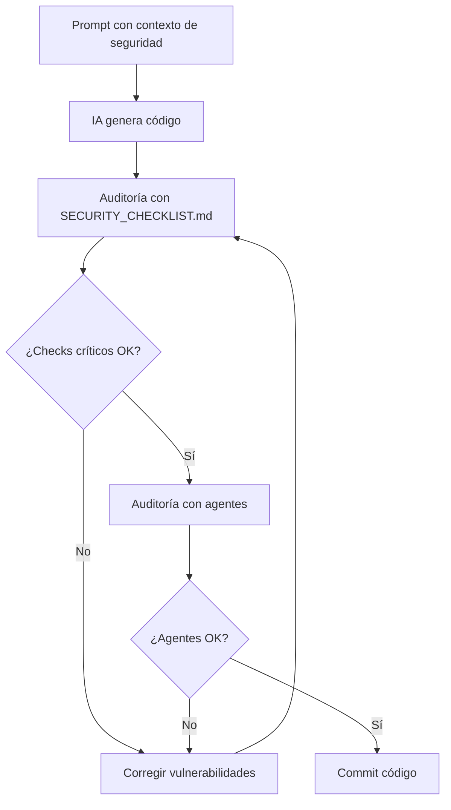

# Ejercicio 4: Crear tu checklist de auditoría reutilizable

**Duración estimada**: 20 minutos
**Objetivo**: Crear un checklist de seguridad personalizado para auditar código generado por IA en tus proyectos.

---

## Contexto

Has aprendido a detectar vulnerabilidades y auditar código. Ahora crearás un **checklist reutilizable** que podrás usar en todos tus proyectos FastAPI.

---

## Parte 1: Generar checklist base con IA (5 min)

### Prompt para Security Hardening Mentor

```
Actúa como Security Hardening Mentor. Crea un checklist exhaustivo para auditar código FastAPI generado por IA.

El checklist debe cubrir:
1. OWASP Top 10 para APIs
2. Validación de entrada/salida con Pydantic
3. Autenticación y autorización
4. Logging y monitoreo de seguridad
5. Manejo de errores
6. Configuración segura (.env, secrets)
7. Diseño de API (RESTful, status codes)
8. Testing de seguridad

Formato:
- Markdown con checkboxes
- Dividido por categorías
- Con ejemplos de código de qué buscar (vulnerable vs seguro)
- Nivel de severidad para cada item (Crítico/Alto/Medio/Bajo)

Debe ser práctico y fácil de usar en 5-10 minutos por endpoint.
```

### Tarea

1. Ejecuta el prompt con el agente
2. Copia el checklist generado en `SECURITY_CHECKLIST.md`
3. **No edites aún** - lo personalizarás en la siguiente parte

---

## Parte 2: Personalizar para tu proyecto (10 min)

### Instrucciones

Edita `SECURITY_CHECKLIST.md` y personaliza estas secciones:

#### 1. Agrega contexto de tu proyecto

```markdown
# Security Audit Checklist - API de Tareas

**Proyecto**: [Nombre de tu proyecto]
**Tecnologías**: FastAPI 0.115+, Pydantic 2.10+, Python 3.12
**Última actualización**: [Fecha]
**Auditado con**: Safety, Bandit, agentes educacionales

## Cómo usar este checklist

1. Genera código con IA (incluir contexto de seguridad en prompt)
2. Audita con este checklist (5-10 min por endpoint)
3. Usa agentes especializados para validación adicional
4. Corrige vulnerabilidades detectadas
5. Re-audita antes de commit
```

#### 2. Agrega ejemplos específicos de tu codebase

Por ejemplo, si tu proyecto usa `repositorio.py`, agrega:

```markdown
## Repositorios y ORM

- [ ] ¿Queries usan ORM (SQLAlchemy) en vez de SQL raw?
- [ ] ¿No usa f-strings para construir queries?

**Ejemplo de tu proyecto**:
```python
# ❌ VULNERABLE en repositorio.py
query = f"SELECT * FROM tareas WHERE user_id = {user_id}"

# ✅ SEGURO en repositorio.py
tareas = session.query(Tarea).filter(Tarea.user_id == user_id).all()
```
```

#### 3. Agrega tus vulnerabilidades comunes

Basándote en vulnerabilidades que has encontrado, agrega una sección:

```markdown
## Vulnerabilidades comunes en este proyecto

Estas son vulnerabilidades que hemos encontrado frecuentemente:

### Mass Assignment (A03)
**Severidad**: Alta
**Frecuencia**: 70% de endpoints generados por IA

- [ ] ¿Request body usa Pydantic (no dict)?
- [ ] ¿Campos tienen Field() con validación?
- [ ] ¿Se usa model_dump(exclude_unset=True)?

**Por qué es común**: La IA genera dict por defecto si no especificas Pydantic.

### Ownership no validado (A01)
**Severidad**: Crítica
**Frecuencia**: 90% de endpoints GET/PUT/DELETE

- [ ] ¿Valida tarea.user_id == usuario_actual?
- [ ] ¿Retorna 403 si no autorizado (no 404)?

**Por qué es común**: La IA asume autenticación pero no ownership.
```

#### 4. Agrega scoring

```markdown
## Sistema de scoring

**Total de checks**: 50

### Clasificación de seguridad

- **40-50 checks (80-100%)**: ✅ Código seguro - OK para commit
- **30-39 checks (60-79%)**: ⚠️ Gaps de seguridad - Corregir antes de commit
- **20-29 checks (40-59%)**: ❌ Código vulnerable - NO commit
- **0-19 checks (<40%)**: ⛔ Críticamente vulnerable - Reescribir con contexto de seguridad

### Checks críticos (bloquean commit si fallan)

Estos 10 checks **DEBEN** pasar siempre:

1. [ ] Endpoints requieren autenticación (`Depends`)
2. [ ] Validación de ownership en GET/PUT/DELETE
3. [ ] Pydantic para validación de entrada (no `dict`)
4. [ ] API Keys hasheadas (no texto plano)
5. [ ] Secrets.compare_digest para comparaciones
6. [ ] Logging de eventos críticos (CRUD)
7. [ ] HTTPException para errores (no return dict)
8. [ ] Status codes correctos (200/201/204/403/404)
9. [ ] No usa eval(), exec(), pickle.load()
10. [ ] Safety check sin vulnerabilidades críticas

Si **cualquiera** de estos falla → 🚫 NO COMMIT
```

---

## Parte 3: Probarlo en código real (5 min)

### Instrucciones

1. Toma uno de los archivos vulnerable de `ejemplos_vulnerables/`

2. Audítalo con TU checklist personalizado

3. Anota el resultado:

```
**Archivo auditado**: ejemplos_vulnerables/a01_broken_access_control.py
**Checks aprobados**: _____ / 50
**Clasificación**: _____________
**Checks críticos fallidos**: _____________
**¿Bloquea commit?**: Sí / No
```

4. Si encontraste nuevas vulnerabilidades no cubiertas en el checklist, **agrégalas**

---

## Parte 4: Integrar en tu workflow (bonus)

### Workflow recomendado con IA + Checklist



### Integración en pre-commit hook

Puedes crear un hook que valide el checklist automáticamente:

```bash
# .githooks/pre-commit
#!/bin/bash

echo "Validando seguridad con Safety..."
safety check --json

echo "Validando código con Bandit..."
bandit -r api/ -ll

echo "Recuerda auditar con SECURITY_CHECKLIST.md antes de commit"
```

### Agregar a PR template

```markdown
## Security Checklist

- [ ] Código auditado con `SECURITY_CHECKLIST.md`
- [ ] Checks críticos aprobados (10/10)
- [ ] Total de checks: _____ / 50 (mínimo 40)
- [ ] Auditado con agentes (FastAPI Coach, Python Coach, API Reviewer)
- [ ] Safety check sin vulnerabilidades críticas
- [ ] Tests de seguridad pasando
```

---

## Template final del checklist

<details>
<summary>Haz clic para ver el template completo</summary>

Copia este template en `SECURITY_CHECKLIST.md` y personalízalo:

```markdown
# Security Audit Checklist - Código Generado por IA

**Proyecto**: [Tu proyecto]
**Última actualización**: [Fecha]
**Versión**: 1.0

## Instrucciones de uso

1. Genera código con IA (incluir contexto de seguridad en prompt)
2. Audita con este checklist (5-10 min por endpoint)
3. Marca ✅ si aprueba, ❌ si falla
4. Si <40/50 checks, NO commit hasta corregir
5. Re-audita con agentes especializados

---

## Categoría 1: Validación de Entrada (A03 Injection)

**Severidad**: Alta | **Checks**: 8

- [ ] Request bodies usan Pydantic BaseModel (no dict)
- [ ] Campos tienen Field() con min_length, max_length
- [ ] Query params tienen Query() con ge, le
- [ ] No usa eval(), exec(), compile(), __import__()
- [ ] Queries SQL usan ORM (no f-strings)
- [ ] No deserializa con pickle.load()
- [ ] Valida tipos de datos (int, str, bool)
- [ ] Previene mass assignment (solo campos específicos)

**Ejemplo**:
```python
# ❌ VULNERABLE
@app.post("/tareas")
def crear(datos: dict): pass

# ✅ SEGURO
class CrearTareaRequest(BaseModel):
    nombre: str = Field(..., min_length=1, max_length=100)

@app.post("/tareas")
def crear(datos: CrearTareaRequest): pass
```

---

## Categoría 2: Control de Acceso (A01 Broken Access Control)

**Severidad**: Crítica | **Checks**: 6

- [ ] Endpoints protegidos usan Depends(obtener_usuario_actual)
- [ ] Valida ownership en GET/PUT/DELETE (tarea.user_id == usuario_actual)
- [ ] Retorna 403 Forbidden si no autorizado (no 404)
- [ ] Retorna 404 si recurso no existe
- [ ] No expone información de otros usuarios
- [ ] Filtra listados por user_id (no retorna todo)

**Ejemplo**:
```python
# ✅ SEGURO
@app.get("/tareas/{id}")
def obtener(id: int, user: int = Depends(auth)):
    tarea = servicio.obtener(id)
    if not tarea:
        raise HTTPException(404)
    if tarea.user_id != user:
        raise HTTPException(403)  # ✅ 403, no 404
    return tarea
```

---

## Categoría 3: Autenticación (A07 Authentication Failures)

**Severidad**: Crítica | **Checks**: 7

- [ ] API Keys hasheadas (SHA-256 mínimo)
- [ ] Comparación con secrets.compare_digest (no ==)
- [ ] API Keys generadas con secrets.token_urlsafe(32)
- [ ] API Keys de 32+ caracteres
- [ ] Secrets en .env (no hardcodeados)
- [ ] API Keys con expiración (opcional pero recomendado)
- [ ] Logging de intentos de autenticación fallidos

**Ejemplo**:
```python
# ✅ SEGURO
import secrets
import hashlib

def verificar_api_key(api_key: str) -> int:
    hash_actual = hashlib.sha256(api_key.encode()).hexdigest()
    if secrets.compare_digest(hash_actual, hash_esperado):
        return user_id
    raise HTTPException(401)
```

---

## Categoría 4: Logging (A09 Security Logging Failures)

**Severidad**: Alta | **Checks**: 6

- [ ] Logging de autenticación fallida
- [ ] Logging de accesos no autorizados (403)
- [ ] Logging de eventos críticos (creación, actualización, eliminación)
- [ ] Formato estructurado (JSON o extra={"event": ...})
- [ ] No registra información sensible (passwords, API Keys)
- [ ] Logs van a sistema centralizado (Sentry, ELK, CloudWatch)

**Ejemplo**:
```python
# ✅ SEGURO
logger.info(
    f"Tarea {id} eliminada",
    extra={
        "event": "tarea_eliminada",
        "tarea_id": id,
        "user_id": user
    }
)
```

---

## Categoría 5: Manejo de Errores

**Severidad**: Media | **Checks**: 5

- [ ] Usa HTTPException (no return {"error": ...})
- [ ] Status codes correctos (200/201/204/403/404/422)
- [ ] Mensajes de error genéricos (no exponen stack traces)
- [ ] No expone información sensible en errores
- [ ] Sentry captura excepciones en producción

---

## Categoría 6: Dependencias (A08 Software Integrity)

**Severidad**: Alta | **Checks**: 5

- [ ] requirements.txt con versiones pinneadas
- [ ] safety check sin vulnerabilidades críticas/altas
- [ ] Dependencias actualizadas (últimos 6 meses)
- [ ] No instala desde fuentes no confiables
- [ ] Builds reproducibles

---

## Categoría 7: Diseño de API

**Severidad**: Media | **Checks**: 7

- [ ] Versionado de API (/v1/)
- [ ] Paginación en listados (limite, offset)
- [ ] Validación de límites (Query(ge=1, le=100))
- [ ] Response models consistentes
- [ ] Rate limiting (opcional pero recomendado)
- [ ] CORS configurado correctamente (no allow_origins=["*"])
- [ ] Documentación OpenAPI/Swagger actualizada

---

## Categoría 8: Configuración Segura

**Severidad**: Alta | **Checks**: 6

- [ ] Secrets en .env (no hardcodeados)
- [ ] .env en .gitignore
- [ ] .env.template con valores de ejemplo
- [ ] Validación de variables de entorno al inicio
- [ ] DEBUG=False en producción
- [ ] No expone stack traces en producción

---

## Checks Críticos (bloquean commit si fallan)

Estos 10 checks **DEBEN** pasar siempre:

1. [ ] Endpoints requieren autenticación (Depends)
2. [ ] Validación de ownership en GET/PUT/DELETE
3. [ ] Pydantic para validación (no dict)
4. [ ] API Keys hasheadas
5. [ ] secrets.compare_digest para comparaciones
6. [ ] Logging de eventos críticos
7. [ ] HTTPException para errores
8. [ ] Status codes correctos
9. [ ] No usa eval/exec/pickle
10. [ ] Safety check sin vulnerabilidades críticas

---

## Scoring

**Total de checks**: 50
**Checks aprobados**: _____ / 50
**Porcentaje**: _____ %

**Clasificación**:
- 40-50 (80-100%): ✅ Seguro
- 30-39 (60-79%): ⚠️ Gaps de seguridad
- 20-29 (40-59%): ❌ Vulnerable
- 0-19 (<40%): ⛔ Críticamente vulnerable

**¿Bloquea commit?**: Sí / No

---

## Acciones recomendadas

Basándote en el resultado:

**✅ Seguro (40-50 checks)**:
- OK para commit
- Auditar con agentes para validación adicional
- Ejecutar tests de seguridad

**⚠️ Gaps (30-39 checks)**:
- Corregir gaps antes de commit
- Usar agentes para identificar problemas restantes
- Re-auditar después de correcciones

**❌ Vulnerable (20-29 checks)**:
- NO commit hasta corregir
- Usar prompt mejorado con contexto de seguridad
- Re-generar código con IA

**⛔ Críticamente vulnerable (<20 checks)**:
- Reescribir completamente
- Incluir contexto de seguridad en prompt
- Seguir patrón: Generar → Auditar → Corregir → Re-auditar
```

</details>

---

## Reflexión final

**Responde en `ejercicio_4_respuestas.md`**:

1. ¿Cuántas categorías tiene tu checklist final?

2. ¿Qué categoría consideras más importante para tu proyecto?

3. ¿Cómo integrarás este checklist en tu workflow diario?

4. ¿Agregarías o eliminarías alguna categoría? ¿Por qué?

5. ¿Cada cuánto actualizarás este checklist?

---

## Checklist de completitud

- [ ] Generé checklist base con Security Hardening Mentor
- [ ] Personalicé con ejemplos de mi proyecto
- [ ] Agregué vulnerabilidades comunes detectadas
- [ ] Implementé sistema de scoring
- [ ] Definí checks críticos que bloquean commit
- [ ] Probé el checklist en código real
- [ ] Documenté cómo integrar en workflow
- [ ] Respondí preguntas de reflexión

**¡Excelente trabajo!** Ahora tienes un checklist reutilizable para auditar cualquier código generado por IA en tu proyecto.
