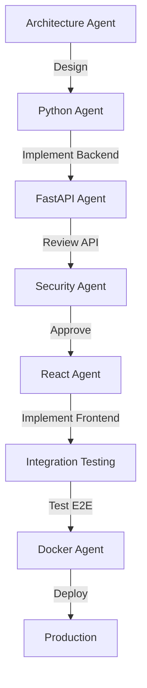

# Agent Team Canvas Framework

El **Agent Team Canvas** es un framework para planificar, ejecutar y documentar proyectos de software usando equipos de agentes especializados.

## 📋 Tabla de Contenidos

1. [¿Qué es el Agent Team Canvas?](#qué-es-el-agent-team-canvas)
2. [Componentes del Canvas](#componentes-del-canvas)
3. [Cómo Usar el Framework](#cómo-usar-el-framework)
4. [Template del Canvas](#template-del-canvas)
5. [Ejemplo Completo: E-commerce Platform](#ejemplo-completo-e-commerce-platform)
6. [Best Practices](#best-practices)

---

## ¿Qué es el Agent Team Canvas?

Es un documento visual y estructurado que te ayuda a:

- ✅ **Dividir** proyectos grandes en tareas manejables
- ✅ **Asignar** tareas a agentes especializados
- ✅ **Coordinar** el trabajo entre múltiples agentes
- ✅ **Documentar** decisiones y workflow
- ✅ **Evaluar** efectividad de cada agente

### Analogía: Blueprint de Construcción

| Blueprint Arquitectónico | Agent Team Canvas |
|--------------------------|-------------------|
| Plano de edificio | Estructura del proyecto |
| Tareas por especialidad | Tareas por agente |
| Secuencia de construcción | Workflow de agentes |
| Inspecciones de calidad | Code reviews por agentes |
| Documentación final | Git history + Canvas |

---

## Componentes del Canvas

### 1. Project Overview

**¿Qué incluye?**
- Nombre del proyecto
- Descripción en 2-3 líneas
- Objetivos principales
- Tech stack
- Timeline estimado

**Ejemplo**:
```
Proyecto: TravelBuddy - Travel Planning App
Descripción: Aplicación para planificar viajes con IA que sugiere itinerarios,
             reserva hoteles y organiza actividades.
Objetivos: MVP funcional en 3 semanas, deploy a producción
Tech Stack: FastAPI + React + PostgreSQL + OpenAI API
Timeline: 15-20 días (100-120 horas)
```

### 2. Feature Breakdown

**¿Qué incluye?**
- Lista de features principales
- Priorización (Must-have, Should-have, Nice-to-have)
- Dependencias entre features

**Formato**:
```
Feature: User Authentication
Priority: Must-have (P0)
Dependencies: None
Estimated: 2-3 días

Sub-features:
- [ ] User registration (email + password)
- [ ] Login with JWT
- [ ] Password reset flow
- [ ] OAuth integration (Google)
```

### 3. Architecture Decisions

**¿Qué incluye?**
- Estructura de directorios
- Patrones arquitectónicos (MVC, Clean Architecture, etc)
- Decisiones técnicas clave (por qué PostgreSQL, por qué React Query, etc)

**Formato**:
```
Decision: Use Clean Architecture with Repository Pattern
Rationale:
- Separar business logic de infraestructura
- Facilitar testing (mock repositories)
- Permitir cambiar database sin reescribir lógica

Alternative Considered: Monolithic MVC
Why Not Chosen: Menos escalable, testing más difícil
```

### 4. Agent Assignment Matrix

**¿Qué incluye?**
- Tabla de Agente → Tareas asignadas
- Agente principal y revisor para cada tarea
- Status de cada tarea

**Formato**:
```
| Task | Primary Agent | Reviewer Agent | Status | Notes |
|------|---------------|----------------|--------|-------|
| Design DB schema | Database ORM | Architecture | ✅ Done | 5 tables, normalized |
| Implement auth | Python Best Practices | Security | 🔄 In Progress | JWT + bcrypt |
| Create login UI | React Integration | - | ⏸️ Blocked | Waiting for API |
| Setup Docker | Docker Infrastructure | Performance | 📋 Todo | Multi-stage build |
```

**Status Icons**:
- ✅ Done
- 🔄 In Progress
- ⏸️ Blocked
- 📋 Todo
- ⚠️ Issues Found
- 🔁 Needs Rework

### 5. Workflow Diagram

**¿Qué incluye?**
- Flujo de trabajo entre agentes
- Secuencia de tareas
- Puntos de revisión

**Ejemplo (Mermaid)**:


### 6. Testing Strategy

**¿Qué incluye?**
- Qué tipos de tests se harán
- Coverage targets
- Quién escribe cada test

**Formato**:
```
Testing Layers:

1. Unit Tests (Backend)
   - Agent: Python Best Practices Agent
   - Tools: pytest
   - Coverage: ≥80%
   - Scope: Functions, classes, service layer

2. Unit Tests (Frontend)
   - Agent: React Integration Agent
   - Tools: Vitest + React Testing Library
   - Coverage: ≥70%
   - Scope: Components, hooks

3. Integration Tests
   - Agent: Python + React Agents (collaboration)
   - Tools: pytest (API) + Playwright (E2E)
   - Coverage: Critical user flows
   - Scope: Auth flow, checkout flow, etc

4. Performance Tests
   - Agent: Performance Optimizer Agent
   - Tools: locust.io
   - Target: <100ms p95 for API, <2s page load
```

### 7. Review Checklist

**¿Qué incluye?**
- Criterios de calidad por tipo de código
- Checklist de seguridad
- Checklist de performance

**Formato**:
```
Backend Code Review Checklist:
- [ ] Type hints en todas las funciones
- [ ] Docstrings en funciones públicas
- [ ] Pydantic validation para inputs
- [ ] Error handling robusto (custom exceptions)
- [ ] Tests con ≥80% coverage
- [ ] No secrets hardcodeados
- [ ] Database queries optimizadas (no N+1)
- [ ] Logging apropiado (INFO level)

Frontend Code Review Checklist:
- [ ] TypeScript sin errores (npx tsc --noEmit)
- [ ] Components con PropTypes/interfaces
- [ ] Accessible (ARIA labels, keyboard navigation)
- [ ] Responsive (mobile, tablet, desktop)
- [ ] Error boundaries
- [ ] Loading states
- [ ] No console.log en build de producción
```

### 8. Lessons Learned

**¿Qué incluye?**
- Qué funcionó bien
- Qué no funcionó
- Qué harías diferente
- Insights sobre efectividad de agentes

**Formato**:
```
✅ What Worked Well:
- Architecture Agent diseñó estructura sólida (0 refactors grandes)
- Security Agent previno 5 vulnerabilidades antes de merge
- Pair review (Python + FastAPI Agents) mejoró calidad de API

❌ What Didn't Work:
- React Agent generó código muy verboso (necesité simplificar)
- No tuve clear acceptance criteria (re-trabajo innecesario)
- Integración frontend-backend tomó más de lo esperado (APIs cambiaron)

💡 Insights:
- Definir API contract ANTES de implementar frontend/backend ahorra tiempo
- Security reviews tempranas (no al final) previenen re-trabajo
- Performance Agent es más útil DESPUÉS de feature completa (no antes)

🔄 Next Time:
- Usar OpenAPI spec para definir API contract
- Security review después de cada feature (no batch)
- Asignar Performance Agent solo cuando hay datos reales de performance
```

---

## Cómo Usar el Framework

### Fase 1: Pre-Planning (Antes de Escribir Código)

**Tiempo**: 1-2 horas para proyectos medianos

**Pasos**:

1. **Define Project Overview**
   - Escribe descripción clara del proyecto
   - Lista tech stack
   - Estima timeline (realista + buffer 20%)

2. **List Features**
   - Brainstorm todas las features
   - Prioriza con MoSCoW (Must, Should, Could, Won't)
   - Identifica dependencias

3. **Invoke Architecture Agent**
   ```
   Prompt:
   Actúa como Architecture Agent. Diseña la arquitectura para:

   [Pega Project Overview + Features]

   Genera:
   1. Estructura de directorios completa
   2. Modelos de base de datos con relaciones
   3. Lista de endpoints de API
   4. Componentes principales de frontend
   5. Decisiones arquitectónicas con rationale
   ```

4. **Create Agent Assignment Matrix**
   - Por cada feature/tarea, asigna agente principal
   - Identifica tareas que necesitan revisor
   - Ordena tareas por dependencias (topological sort)

5. **Document in Canvas**
   - Llena el template (ver abajo)
   - Guarda como `AGENT_TEAM_CANVAS.md` en root del proyecto
   - Commit inicial: `docs: add Agent Team Canvas`

### Fase 2: Implementation (Durante Desarrollo)

**Workflow Diario**:

```
Morning:
1. Revisa Agent Assignment Matrix
2. Selecciona siguiente tarea con status "Todo"
3. Cambia status a "In Progress"
4. Invoca agente asignado con prompt específico

During Development:
5. Agente genera código
6. Tú revisas output
7. Si hay reviewer agent: invoca reviewer
8. Si hay issues: marca tarea como "⚠️ Issues Found" y ajusta

End of Day:
9. Cambia status de tareas completadas a "✅ Done"
10. Agrega notas en columna "Notes" (ej: "Took longer than expected")
11. Actualiza Canvas con progreso
12. Commit changes + update Canvas
```

**Regla de Oro**: Canvas debe ser **single source of truth** del proyecto.

### Fase 3: Review & Integration

**Cuando**:
- Después de cada feature completa
- Antes de crear Pull Request
- Antes de deploy a producción

**Pasos**:

1. **Run Full Test Suite**
   ```bash
   # Backend
   pytest --cov=api --cov-report=term-missing

   # Frontend
   npm run test
   npm run test:e2e
   ```

2. **Invoke Review Agents**
   ```
   Secuencia de review:
   1. Python Best Practices Agent → revisa código Python
   2. FastAPI Design Agent → revisa API design
   3. Security Agent → audita vulnerabilidades
   4. Performance Agent → detecta bottlenecks
   ```

3. **Address Issues**
   - Por cada issue encontrado, crea task en matriz
   - Asigna agente para fix
   - Re-review después de fix

4. **Update Canvas**
   - Marca feature como completada
   - Agrega métricas (LOC, tests, coverage, tiempo real vs estimado)
   - Documenta issues encontrados y cómo se resolvieron

### Fase 4: Post-Mortem (Después de Deploy)

**Timing**: Dentro de 1 semana de deployment

**Pasos**:

1. **Collect Metrics**
   - Tiempo real de desarrollo vs estimado
   - Test coverage final (backend, frontend)
   - Bugs encontrados en producción (primeros 7 días)
   - Performance real (response times, page load)

2. **Evaluate Agent Effectiveness**
   ```
   Pregunta por cada agente:
   - ¿Qué % de su código necesitó cambios?
   - ¿Cuántos bugs introdujo?
   - ¿Cuánto tiempo ahorró vs hacer tú mismo?
   - ¿Lo volverías a usar en próximo proyecto?
   ```

3. **Complete Lessons Learned Section**
   - Sé honesto sobre qué funcionó y qué no
   - Identifica patrones (ej: "Security reviews tempranas son críticas")
   - Documenta insights accionables

4. **Archive Canvas**
   - Guarda versión final en `docs/AGENT_TEAM_CANVAS_FINAL.md`
   - Usa como referencia para próximos proyectos
   - Comparte learnings con equipo (si aplica)

---

## Template del Canvas

Copia este template para tus proyectos:

```markdown
# Agent Team Canvas: [Nombre del Proyecto]

## 1. Project Overview

**Descripción**: [1-3 líneas]

**Objetivos**:
- [ ] Objetivo 1
- [ ] Objetivo 2
- [ ] Objetivo 3

**Tech Stack**:
- Backend: [FastAPI, Django, etc]
- Frontend: [React, Vue, etc]
- Database: [PostgreSQL, MongoDB, etc]
- Infrastructure: [Docker, AWS, etc]

**Timeline**:
- Estimado: [X semanas]
- Real: [Llenar al final]

---

## 2. Feature Breakdown

### Must-Have (P0)

**Feature 1: [Nombre]**
- Priority: P0
- Dependencies: [None / Feature X]
- Estimated: [X días]
- Actual: [Llenar al final]

Sub-features:
- [ ] Sub-feature 1.1
- [ ] Sub-feature 1.2

### Should-Have (P1)

[Igual formato]

### Nice-to-Have (P2)

[Igual formato]

---

## 3. Architecture Decisions

### Decision 1: [Título]

**What**: [Qué decidiste]

**Why**: [Por qué esta opción]

**Alternatives Considered**: [Qué más consideraste]

**Trade-offs**: [Ventajas y desventajas]

---

## 4. Agent Assignment Matrix

| Task | Primary Agent | Reviewer | Status | Est. | Actual | Notes |
|------|---------------|----------|--------|------|--------|-------|
| Design DB schema | Database ORM | Architecture | 📋 Todo | 4h | - | - |
| Implement auth | Python BP | Security | 📋 Todo | 8h | - | - |
| ... | ... | ... | ... | ... | ... | ... |

**Legend**:
- ✅ Done
- 🔄 In Progress
- ⏸️ Blocked
- 📋 Todo
- ⚠️ Issues
- 🔁 Rework

---

## 5. Workflow Diagram

```
[Pega diagram aquí - puede ser texto o Mermaid]
```

---

## 6. Testing Strategy

### Unit Tests (Backend)
- Agent: [Agente]
- Tools: [pytest, etc]
- Coverage Target: [80%]
- Status: [Not Started / In Progress / Done]

### Unit Tests (Frontend)
[Igual formato]

### Integration Tests
[Igual formato]

### E2E Tests
[Igual formato]

---

## 7. Review Checklist

### Backend
- [ ] Type hints
- [ ] Docstrings
- [ ] Tests ≥80%
- [ ] No secrets hardcoded
- [ ] Error handling
- [ ] ...

### Frontend
- [ ] TypeScript compile
- [ ] Responsive
- [ ] Accessible
- [ ] ...

### Security
- [ ] SQL injection prevention
- [ ] XSS prevention
- [ ] CSRF protection
- [ ] ...

---

## 8. Metrics (Llenar al Final)

### Development Time
- Estimated: [X horas]
- Actual: [Y horas]
- Variance: [(Y-X)/X * 100%]

### Code Quality
- Backend Coverage: [%]
- Frontend Coverage: [%]
- LOC Backend: [X]
- LOC Frontend: [X]
- Bugs Found (week 1): [X]

### Agent Effectiveness
| Agent | Code Generated | Bugs Introduced | Bugs Prevented | Effectiveness |
|-------|----------------|-----------------|----------------|---------------|
| Python | 1200 LOC | 2 | - | ⭐⭐⭐⭐ |
| Security | 0 (review only) | - | 8 | ⭐⭐⭐⭐⭐ |
| ... | ... | ... | ... | ... |

---

## 9. Lessons Learned

### ✅ What Worked Well
1. [Insight 1]
2. [Insight 2]

### ❌ What Didn't Work
1. [Issue 1]
2. [Issue 2]

### 💡 Key Insights
1. [Insight 1]
2. [Insight 2]

### 🔄 Next Time
1. [Acción 1]
2. [Acción 2]

---

## 10. References

- [Link a docs del proyecto]
- [Link a API reference]
- [Link a deployment guide]
```

---

## Ejemplo Completo: E-commerce Platform

Ver archivo completo en: `ejemplos/ECOMMERCE_AGENT_CANVAS.md`

**Highlights del ejemplo**:
- 15 features divididas en 3 prioridades
- 7 agentes especializados usados
- 45 tareas asignadas en matriz
- Workflow de 4 fases documentado
- Métricas reales de desarrollo (3 semanas, 2800 LOC)
- Lecciones aprendidas detalladas

---

## Best Practices

### 1. Mantén el Canvas Actualizado

❌ **Mal**:
```
Día 1: Creas Canvas
Día 5: Canvas está desactualizado (status no se actualizó)
Día 10: Canvas es inútil (nadie lo mira)
```

✅ **Bien**:
```
Día 1: Creas Canvas
Día 2-10: Al final de cada día actualizas status
Día 10: Canvas refleja estado real del proyecto
```

**Regla**: Si una tarea cambió de status, actualiza Canvas **antes** de hacer commit.

### 2. Sé Específico en Prompts

❌ **Mal**:
```
"Python Agent, implementa autenticación"
```

✅ **Bien**:
```
"Python Agent, implementa JWT authentication service con:
- register_user(email, password) → User
- login_user(email, password) → JWT token
- Bcrypt hashing (12 rounds)
- Email validation
- Strong password requirements
- Custom exceptions (EmailExistsError, InvalidCredentialsError)
- Type hints + docstrings
- Tests con ≥85% coverage"
```

**Principio**: Cuanto más específico el prompt, mejor el output.

### 3. Review Chains para Código Crítico

Para código de seguridad, pagos, o logic compleja:

```
Primary Agent (implementa) → Specialist Reviewer → Security Agent → Tú (apruebas)
```

**Ejemplo**:
```
Task: Implementar payment processing

Workflow:
1. Python Agent → implementa Stripe integration
2. FastAPI Agent → revisa API design (idempotency, error handling)
3. Security Agent → audita (credentials, PCI compliance, logging)
4. Tú → apruebas y mergeas
```

### 4. Documenta Decisiones No-Obvias

Si hiciste una decisión no estándar, documéntala:

```markdown
### Decision: No usar ORM para analytics queries

**What**: Raw SQL para queries complejas de dashboard

**Why**:
- SQLAlchemy genera SQL ineficiente para JOINs complejos
- Queries analíticas son read-only (no necesitamos ORM features)
- Performance: 300ms con ORM → 50ms con raw SQL

**Trade-offs**:
- ✅ Pro: 6x más rápido
- ❌ Con: Más difícil mantener (SQL como strings)
- ❌ Con: No type-checked
```

### 5. Celebra los Wins de Agentes

Cuando un agente hace algo brillante, documéntalo:

```markdown
### 🌟 Agent Win: Security Agent Prevented Critical Vulnerability

**What**: Security Agent detectó timing attack en login

**Impact**: Sin el catch, attacker podría enumerar emails válidos

**Fix**: Usar constant-time comparison + artificial delay

**Lesson**: Security reviews tempranas son CRÍTICAS
```

### 6. No Subestimes Estimation

**Regla de Thumb**:

```
Estimación inicial = [Tu estimate] * 1.5 (buffer para imprevistos)

Si es primera vez con tecnología = [Tu estimate] * 2
Si es feature crítica (auth, pagos) = [Tu estimate] * 1.8
Si tiene muchas dependencias = [Tu estimate] * 1.7
```

**Realidad**: Tus estimates son optimistas. Los agentes ayudan pero aún hay:
- Integration issues
- Re-work por requirements ambiguos
- Debugging
- Review cycles

### 7. Un Canvas por Proyecto (No por Feature)

❌ **Mal**: Canvas separado para cada feature

✅ **Bien**: Un Canvas que documenta TODO el proyecto

**Razón**: Canvas es living document. Tener múltiples Canvas crea confusión.

**Excepción**: Si feature es súper grande (>1 semana), ok tener sub-canvas.

---

## FAQ

### ¿Cuándo NO usar Agent Team Canvas?

- **Proyectos pequeños** (<1 día de trabajo): Overhead innecesario
- **Prototipos desechables**: No vale la pena documentar
- **Solo estás explorando**: Usa Jupyter notebook o quick script

### ¿Cuántos agentes son "demasiados"?

**Regla**: Si tienes >10 agentes, probablemente estás sobre-complicando.

**Sweet spot**: 3-7 agentes para proyecto mediano

**Ejemplo**:
- Proyecto pequeño (TODO app): 2-3 agentes
- Proyecto mediano (E-commerce): 5-7 agentes
- Proyecto grande (Enterprise CRM): 8-10 agentes

### ¿Qué hago si un agente no cumple expectativas?

1. **Ajusta el prompt**: Sé más específico
2. **Cambia el agente**: Usa otro especialista
3. **Haz tú mismo la tarea**: A veces es más rápido
4. **Documenta en "Lessons Learned"**: Para próxima vez

### ¿Debo versionar el Canvas en Git?

**SÍ, absolutamente.**

```bash
git add AGENT_TEAM_CANVAS.md
git commit -m "docs: update canvas with auth implementation progress"
```

**Beneficio**: Git history muestra evolución del proyecto.

### ¿Canvas reemplaza documentación técnica?

**No.** Canvas complementa, no reemplaza:

- **Canvas**: Planning, workflow, agent coordination
- **README.md**: Setup instructions, usage
- **API docs**: Endpoint specs (OpenAPI)
- **Architecture docs**: Diagramas, decisiones técnicas

---

## Recursos Adicionales

- **Template completo**: `ejemplos/AGENT_CANVAS_TEMPLATE.md`
- **Ejemplo E-commerce**: `ejemplos/ECOMMERCE_AGENT_CANVAS.md`
- **Video tutorial**: [Coming soon]
- **Canvas Generator Tool**: [Coming soon]

---

**Next Steps**:
1. Copia el template
2. Llena Project Overview
3. Usa el Canvas para tu próximo proyecto
4. Documenta learnings
5. Itera y mejora tu proceso

**¡Feliz orquestación de agentes! 🎻🎺🎷**
