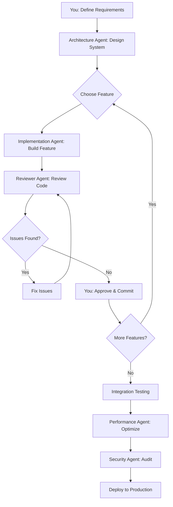

# Agent Team Canvas: [Nombre del Proyecto]

## 1. Project Overview

**Descripción**: [Describe el proyecto en 1-3 líneas]

**Objetivos**:
- [ ] Objetivo 1
- [ ] Objetivo 2
- [ ] Objetivo 3

**Tech Stack**:
- Backend: [FastAPI, Django, Flask, etc]
- Frontend: [React, Vue, Svelte, etc]
- Database: [PostgreSQL, MongoDB, MySQL, etc]
- Infrastructure: [Docker, AWS, Railway, etc]
- Other: [Redis, Celery, etc]

**Timeline**:
- Estimated: [X semanas / Y días]
- Actual: [Llenar al completar]
- Variance: [% diferencia]

---

## 2. Feature Breakdown

### Must-Have Features (P0)

#### Feature 1: [Nombre del Feature]

**Priority**: P0 (Must-have)
**Dependencies**: [None / Feature X]
**Estimated**: [X horas / días]
**Actual**: [Llenar al completar]

**Sub-features**:
- [ ] Sub-feature 1.1: [Descripción]
- [ ] Sub-feature 1.2: [Descripción]
- [ ] Sub-feature 1.3: [Descripción]

**Success Criteria**:
- [Criterio 1]
- [Criterio 2]

---

#### Feature 2: [Nombre del Feature]

[Mismo formato que Feature 1]

---

### Should-Have Features (P1)

#### Feature 3: [Nombre del Feature]

[Mismo formato]

---

### Nice-to-Have Features (P2)

#### Feature 4: [Nombre del Feature]

[Mismo formato]

---

## 3. Architecture Decisions

### Decision 1: [Título de la Decisión]

**What**: [Qué decidiste hacer]

**Why**: [Por qué elegiste esta opción]

**Alternatives Considered**:
- Alternative 1: [Descripción] - [Por qué no]
- Alternative 2: [Descripción] - [Por qué no]

**Trade-offs**:
- ✅ Pros: [Ventajas de esta decisión]
- ❌ Cons: [Desventajas de esta decisión]

**Impact**: [Cómo esta decisión afecta el proyecto]

---

### Decision 2: [Título]

[Mismo formato]

---

## 4. Agent Assignment Matrix

| Task | Primary Agent | Reviewer Agent | Status | Est. Time | Actual Time | Notes |
|------|---------------|----------------|--------|-----------|-------------|-------|
| Design DB schema | Database ORM Agent | Architecture Agent | 📋 Todo | 4h | - | - |
| Implement auth service | Python Best Practices | Security Agent | 📋 Todo | 8h | - | - |
| Create auth endpoints | FastAPI Design Agent | Security Agent | 📋 Todo | 6h | - | - |
| Auth UI components | React Integration Agent | - | 📋 Todo | 8h | - | - |
| Write auth tests | Python Best Practices | - | 📋 Todo | 4h | - | - |
| Setup Docker | Docker Infrastructure | Performance Agent | 📋 Todo | 6h | - | - |

**Status Legend**:
- ✅ Done (Completado)
- 🔄 In Progress (En progreso)
- ⏸️ Blocked (Bloqueado, esperando dependencia)
- 📋 Todo (Por hacer)
- ⚠️ Issues Found (Problemas encontrados, necesita corrección)
- 🔁 Needs Rework (Necesita rehacer)

**Total Estimated**: [Suma de Est. Time]
**Total Actual**: [Suma de Actual Time al completar]

---

## 5. Workflow Diagram



**Alternative formats**:
- Texto simple describiendo el flujo
- Diagram creado con tools externos
- Lista secuencial de pasos

---

## 6. Testing Strategy

### Unit Tests (Backend)

**Agent Responsible**: Python Best Practices Agent
**Tools**: pytest, pytest-cov
**Coverage Target**: ≥80%
**Scope**: Service layer, utility functions, models
**Status**: [Not Started / In Progress / Done]

**Test Files**:
- [ ] `tests/test_auth_service.py`
- [ ] `tests/test_product_service.py`
- [ ] [Agregar más según features]

---

### Unit Tests (Frontend)

**Agent Responsible**: React Integration Agent
**Tools**: Vitest, React Testing Library
**Coverage Target**: ≥70%
**Scope**: Components, hooks, utilities
**Status**: [Not Started / In Progress / Done]

**Test Files**:
- [ ] `frontend/src/components/__tests__/LoginForm.test.tsx`
- [ ] [Agregar más]

---

### Integration Tests

**Agent Responsible**: Python Best Practices + Database ORM Agents
**Tools**: pytest, TestClient (FastAPI)
**Scope**: API endpoints with database
**Status**: [Not Started / In Progress / Done]

**Test Files**:
- [ ] `tests_integration/test_auth_flow.py`
- [ ] [Agregar más]

---

### E2E Tests

**Agent Responsible**: React Integration Agent
**Tools**: Playwright
**Scope**: Critical user flows
**Status**: [Not Started / In Progress / Done]

**Test Scenarios**:
- [ ] User registration → Login → Access protected resource
- [ ] [Agregar más flows críticos]

---

## 7. Code Review Checklist

### Backend Code Review

**Agent**: Python Best Practices + FastAPI Design + Security Agents

- [ ] **Code Quality**
  - [ ] Type hints en todas las funciones públicas
  - [ ] Docstrings en funciones públicas (Google style)
  - [ ] PEP 8 compliance
  - [ ] No código duplicado

- [ ] **API Design**
  - [ ] Status codes correctos (201 Created, 404 Not Found, etc)
  - [ ] Pydantic validation para todos los inputs
  - [ ] Response models bien definidos
  - [ ] Dependency injection usada apropiadamente

- [ ] **Error Handling**
  - [ ] Custom exceptions para casos específicos
  - [ ] HTTPException con mensajes útiles
  - [ ] No `except Exception: pass` genéricos

- [ ] **Security**
  - [ ] No secrets hardcodeados
  - [ ] SQL injection prevention (usar ORM o parameterized queries)
  - [ ] Password hashing con bcrypt (≥12 salt rounds)
  - [ ] Rate limiting en endpoints sensibles

- [ ] **Performance**
  - [ ] No N+1 query problems
  - [ ] Queries optimizadas con indexes
  - [ ] Caching donde apropiado

- [ ] **Testing**
  - [ ] Tests con ≥80% coverage
  - [ ] Tests pasan (`pytest --cov`)
  - [ ] Tests son independientes (no state compartido)

---

### Frontend Code Review

**Agent**: React Integration Agent

- [ ] **Code Quality**
  - [ ] TypeScript sin errores (`npx tsc --noEmit`)
  - [ ] Components con PropTypes/interfaces
  - [ ] No `any` types (usar tipos específicos)
  - [ ] Hooks siguiendo reglas de React

- [ ] **UI/UX**
  - [ ] Responsive (mobile, tablet, desktop)
  - [ ] Accessible (ARIA labels, keyboard navigation)
  - [ ] Loading states
  - [ ] Error handling visible al usuario

- [ ] **Performance**
  - [ ] No re-renders innecesarios (useMemo, useCallback)
  - [ ] Code splitting donde apropiado
  - [ ] Lazy loading de componentes pesados

- [ ] **Testing**
  - [ ] Components críticos tienen tests
  - [ ] User interactions testeadas

---

## 8. Metrics & Results

### Development Time Tracking

| Phase | Estimated | Actual | Variance (%) |
|-------|-----------|--------|--------------|
| Planning | [X]h | [Y]h | [(Y-X)/X * 100]% |
| Backend Development | [X]h | [Y]h | [%] |
| Frontend Development | [X]h | [Y]h | [%] |
| Testing | [X]h | [Y]h | [%] |
| Deployment | [X]h | [Y]h | [%] |
| **TOTAL** | **[X]h** | **[Y]h** | **[%]** |

### Code Quality Metrics

- **Backend Test Coverage**: [X]%
- **Frontend Test Coverage**: [X]%
- **Lines of Code (Backend)**: [X] LOC
- **Lines of Code (Frontend)**: [X] LOC
- **Bugs Found (Week 1)**: [X]
- **Critical Security Issues**: [X] (should be 0)

### Agent Effectiveness

| Agent | Code Generated (LOC) | Bugs Introduced | Bugs Prevented | Review Time | Rating |
|-------|---------------------|-----------------|----------------|-------------|--------|
| Architecture Agent | - (design only) | - | - | [X]min | ⭐⭐⭐⭐⭐ |
| Python Best Practices | [X] LOC | [Y] | - | [Z]min | ⭐⭐⭐⭐ |
| FastAPI Design Agent | [X] LOC | [Y] | - | [Z]min | ⭐⭐⭐⭐ |
| React Integration Agent | [X] LOC | [Y] | - | [Z]min | ⭐⭐⭐⭐ |
| Database ORM Agent | [X] LOC | [Y] | - | [Z]min | ⭐⭐⭐⭐⭐ |
| Security Agent | - (review only) | - | [X] | [Y]min | ⭐⭐⭐⭐⭐ |
| Performance Agent | - (optimization) | - | - | [X]min | ⭐⭐⭐⭐ |

**Rating Scale**:
- ⭐⭐⭐⭐⭐ Excellent: Saved significant time, high quality output
- ⭐⭐⭐⭐ Good: Saved time, minor adjustments needed
- ⭐⭐⭐ Average: Saved some time, needed moderate rework
- ⭐⭐ Below Average: Not much time saved, significant rework
- ⭐ Poor: Would've been faster doing it myself

---

## 9. Lessons Learned

### ✅ What Worked Well

1. **[Insight 1]**
   - Description: [Qué funcionó]
   - Impact: [Cómo ayudó al proyecto]
   - Repeat: [Sí / No / Con modificaciones]

2. **[Insight 2]**
   [Mismo formato]

3. **[Insight 3]**
   [Mismo formato]

---

### ❌ What Didn't Work

1. **[Issue 1]**
   - Description: [Qué no funcionó]
   - Impact: [Cómo afectó el proyecto]
   - Root Cause: [Por qué falló]
   - Fix for Next Time: [Qué hacer diferente]

2. **[Issue 2]**
   [Mismo formato]

---

### 💡 Key Insights

1. **[Insight sobre agentes]**
   - Ejemplo: "Security Agent reviews tempranas previenen re-trabajo masivo"

2. **[Insight sobre workflow]**
   - Ejemplo: "Definir API contracts ANTES de implementar ahorra tiempo de integración"

3. **[Insight sobre arquitectura]**
   - Ejemplo: "Clean Architecture facilitó cambiar de implementación sin afectar lógica"

4. **[Insight sobre estimación]**
   - Ejemplo: "Estimates realistas = estimate inicial * 1.5"

---

### 🔄 Action Items for Next Project

1. **[Acción 1]**
   - What: [Qué cambiar]
   - Why: [Por qué es importante]
   - How: [Cómo implementar]

2. **[Acción 2]**
   [Mismo formato]

3. **[Acción 3]**
   [Mismo formato]

---

## 10. References & Documentation

### Project Documentation

- [README.md](../proyecto-final/README.md) - Setup and usage
- [API_REFERENCE.md](../docs/API_REFERENCE.md) - API endpoints documentation
- [ARCHITECTURE.md](../docs/ARCHITECTURE.md) - Architecture decisions
- [DEPLOYMENT.md](../docs/DEPLOYMENT.md) - Deployment guide

### External Resources

- [Tech stack documentation]
- [Libraries used]
- [Tutorials followed]
- [Articles referenced]

---

## 11. Appendix

### Prompts Used (Examples)

**Architecture Agent Prompt**:
```
[Pega el prompt completo usado para diseñar arquitectura]
```

**Python Best Practices Agent Prompt**:
```
[Pega ejemplo de prompt para implementación]
```

**Security Agent Prompt**:
```
[Pega ejemplo de prompt para security audit]
```

---

### Git Commits Summary

**Total Commits**: [X]
**Features**: [Y]
**Bugfixes**: [Z]
**Refactors**: [W]

**Most Impactful Commits**:
1. `[hash]` - [commit message] - [impact]
2. `[hash]` - [commit message] - [impact]
3. `[hash]` - [commit message] - [impact]

---

### Environment Variables

**Required**:
- `JWT_SECRET` - Secret key for JWT tokens
- `DATABASE_URL` - PostgreSQL connection string
- [Agregar más]

**Optional**:
- `LOG_LEVEL` - Logging level (default: INFO)
- [Agregar más]

---

## Change Log

| Date | Changes | By |
|------|---------|-----|
| [YYYY-MM-DD] | Initial canvas created | [Tu nombre] |
| [YYYY-MM-DD] | Updated with auth implementation progress | [Tu nombre] |
| [YYYY-MM-DD] | Completed lessons learned section | [Tu nombre] |

---

**Canvas Version**: 1.0
**Last Updated**: [Fecha]
**Project Status**: [Planning / In Progress / Completed / Deployed]
