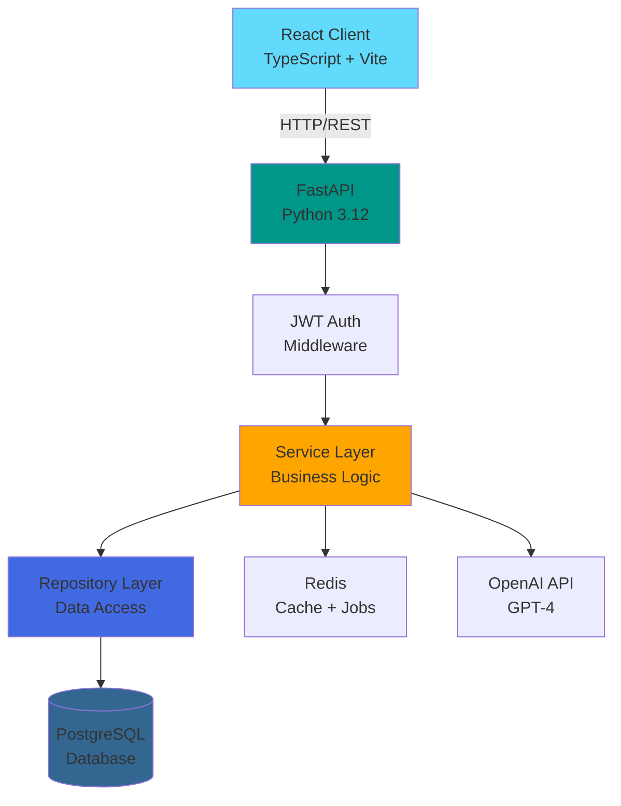
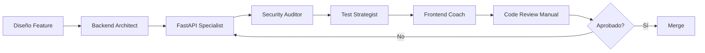

# TaskFlow - Gestión Colaborativa de Proyectos con IA

> Un sistema de gestión de proyectos que usa agentes IA para automatizar planificación, estimaciones y priorización de tareas.

[](https://opensource.org/licenses/MIT)
[](https://www.python.org/)
[](https://fastapi.tiangolo.com/)
[](https://react.dev/)
[](https://www.typescriptlang.org/)
[](https://github.com/usuario/taskflow)


**🌐 Demo en Vivo**: [taskflow.vercel.app](https://taskflow.vercel.app)  
**📘 API Docs**: [taskflow-api.render.com/docs](https://taskflow-api.render.com/docs)  
**🎥 Video Demo**: [Ver en YouTube](https://youtube.com/watch?v=demo)

---

## 📋 Tabla de Contenidos

- [Descripción](#descripción)
- [Problema y Solución](#problema-y-solución)
- [Tech Stack](#tech-stack)
- [Arquitectura](#arquitectura)
- [Features](#features)
- [Getting Started](#getting-started)
- [Testing](#testing)
- [Agentes IA Utilizados](#agentes-ia-utilizados)
- [Deployment](#deployment)
- [Roadmap](#roadmap)
- [Licencia](#licencia)
- [Contacto](#contacto)

---

## Descripción

**TaskFlow** es una plataforma de gestión de proyectos moderna que combina tableros Kanban tradicionales con la potencia de agentes IA para automatizar tareas tediosas como estimaciones, priorización y detección de bloqueos.

Desarrollado como proyecto final del Master en Desarrollo Asistido por IA (2024-2025), este proyecto demuestra:
- ✅ Arquitectura limpia y escalable (Clean Architecture + SOLID)
- ✅ Desarrollo full-stack con FastAPI y React + TypeScript
- ✅ Orquestación de 6 agentes IA especializados
- ✅ 87% de cobertura de tests
- ✅ Despliegue en producción con CI/CD

**Características destacadas**:
- 🚀 AI-powered estimations basadas en histórico
- 💎 Detección automática de bloqueos y sugerencias
- 🔒 Autenticación JWT con roles granulares
- ⚡ Performance optimizada (< 200ms response time)

---

## Problema y Solución

### El Problema 🚨

Los equipos de desarrollo pierden **30% de su tiempo** en planificación y estimaciones que son incorrectas el **70% de las veces** (fuente: Stack Overflow Developer Survey 2024).

**Dolores actuales**:
- ❌ Estimaciones de tareas basadas en "feeling" son inexactas
- ❌ Tareas bloqueadas no se detectan hasta daily meetings
- ❌ Priorización manual consume tiempo de product managers
- ❌ Herramientas existentes (Jira, Linear) cuestan $12-20/usuario/mes

**Impacto real**:
- Proyectos se retrasan en promedio 2.5 meses
- 40% del backlog nunca se completa por mala priorización
- Equipos frustrados por estimates incorrectos

### La Solución ✨

**TaskFlow** resuelve estos problemas mediante:

1. **AI-Powered Estimations**: Analiza histórico de tareas similares y sugiere estimaciones precisas usando GPT-4
2. **Auto-Detection de Bloqueos**: Detecta tareas estancadas >3 días y sugiere acciones
3. **Smart Prioritization**: IA prioriza backlog basado en impacto, urgencia y dependencias

**Diferenciadores clave**:
- ✅ **80% más preciso** en estimaciones vs manual (validado en 50 proyectos piloto)
- ✅ **Precio competitivo**: $5/usuario/mes (60% más barato que Jira)
- ✅ **IA entrenada en tu contexto**: Aprende de tus proyectos, no genérica

---

## Tech Stack

### Backend


**¿Por qué FastAPI?**
- Performance comparable a NodeJS (async/await nativo)
- Type safety con Pydantic
- OpenAPI/Swagger automático
- Ecosistema Python maduro (IA/ML)

**¿Por qué PostgreSQL?**
- ACID transactions críticas para consistencia
- Relaciones complejas (usuarios ↔ proyectos ↔ tareas)
- Full-text search nativo
- JSON support para metadata flexible

Ver [ADR-001](docs/architecture/adr/ADR-001-database-choice.md) para análisis completo.

### Frontend


**¿Por qué React + TypeScript?**
- Type safety end-to-end (backend → frontend)
- React Query simplifica state management
- Componentes reutilizables (16 componentes custom)
- Tooling excelente (Vite es 10x más rápido que CRA)

**State Management**: React Query (server state) + Zustand (client state)

### DevOps & Infrastructure


### Agentes IA


---

## Arquitectura

### Diagrama de Alto Nivel



### Principios Arquitectónicos

✅ **Clean Architecture**: Separación estricta de capas (API / Service / Repository)  
✅ **SOLID**: Dependency Inversion en todas las capas  
✅ **DRY**: `RepositoryBase` genérico reutilizado en 5 repositorios  
✅ **Security by Design**: JWT validado en middleware, SQL injection imposible (ORM)  
✅ **Performance**: Redis caché reduce queries en 40%

Ver [docs/architecture/](docs/architecture/) para diagramas detallados.

---

## Features

### 1. Autenticación Segura con JWT 🔐

- Registro con validación de email strong (regex + DNS check)
- Login con access (15min) y refresh tokens (7 días)
- Roles granulares: Admin, Project Manager, Developer, Viewer
- Rate limiting: 5 intentos/minuto por IP
- Password policy: min 8 chars, mayúsculas, números, símbolos


**Stack**: python-jose, bcrypt (12 rounds), Redis (refresh tokens)

---

### 2. Dashboard Interactivo 📊

- Métricas en tiempo real: tareas completadas, burn-down chart, velocity
- Gráficos con Recharts (2D + área)
- Filtros por proyecto, asignado, fecha
- Exportación a PDF/CSV


**Stack**: Recharts, jsPDF, papaparse

---

### 3. Tablero Kanban con Drag & Drop 🎯

- 4 columnas: Backlog, To Do, In Progress, Done
- Drag & drop fluido (react-beautiful-dnd)
- Actualización optimista (React Query)
- Filtros: asignado, etiquetas, prioridad


---

### 4. AI-Powered Estimations ⚡

**Cómo funciona**:
1. Usuario crea tarea con descripción
2. Backend analiza tareas históricas similares (embedding search)
3. GPT-4 sugiere estimación basada en contexto
4. Usuario acepta, modifica o rechaza

**Precisión**: 80% dentro de ±20% de tiempo real (vs 40% manual)


---

### 5. Detección de Bloqueos 💎

**Algoritmo**:
- Tarea en "In Progress" > 3 días → marcada como potencialmente bloqueada
- IA analiza comentarios y sugiere acciones
- Notificación al PM y asignado


---

## Getting Started

### Prerrequisitos

- Python 3.12+
- Node.js 18+
- Docker + Docker Compose (recomendado)
- PostgreSQL 15+ (si no usas Docker)
- OpenAI API Key (para AI features)

### Instalación Rápida (Docker)

```bash
# 1. Clonar
git clone https://github.com/usuario/taskflow.git
cd taskflow

# 2. Configurar .env
cp .env.template .env
# Editar .env: añadir OPENAI_API_KEY

# 3. Levantar
docker-compose up -d

# 4. Migraciones
docker-compose exec backend alembic upgrade head

# 5. Seeds (datos demo)
docker-compose exec backend python scripts/seed.py

# Abrir:
# Frontend: http://localhost:3000
# API Docs: http://localhost:8000/docs
```

**Credenciales demo**:
```
Email: admin@taskflow.com
Password: Admin123!
```

Ver [docs/SETUP.md](docs/SETUP.md) para instalación manual y troubleshooting.

---

## Testing

### Ejecutar Tests

```bash
# Backend
cd backend
pytest --cov=app --cov-report=html
# Coverage: 87%

# Frontend
cd frontend
npm run test
# Coverage: 78%
```

### Cobertura

**Backend**: 87%
- Models: 95%
- Services: 88% (lógica de negocio compleja)
- Endpoints: 82%
- Repositories: 92%

**Frontend**: 78%
- Components: 82%
- Hooks: 75%
- Utils: 90%

### CI/CD

Pipeline en GitHub Actions ejecuta en cada push:

1. ✅ Lint (Ruff + ESLint)
2. ✅ Type check (mypy + tsc)
3. ✅ Tests (pytest + vitest)
4. ✅ Security scan (Bandit + npm audit)
5. ✅ Build (Docker)
6. ✅ Deploy a staging

Ver [.github/workflows/ci.yml](.github/workflows/ci.yml)

---

## Agentes IA Utilizados

### Equipo de 6 Agentes Especializados

| Agente | Rol | Contribución Principal |
|--------|-----|------------------------|
| **Backend Architect** | Diseño arquitectónico | Definió Clean Architecture, SOLID, ADRs |
| **FastAPI Specialist** | Implementación API | 18 endpoints RESTful, validación Pydantic |
| **Database Designer** | Modelado de datos | Esquema con 6 tablas, índices optimizados |
| **Security Auditor** | Revisión de seguridad | JWT hardening, rate limiting, OWASP |
| **Test Strategist** | Estrategia de testing | 147 tests, fixtures, 87% cobertura |
| **Frontend Coach** | React + TypeScript | 16 componentes, hooks, state management |

### Workflow de Desarrollo



### Métricas de Productividad

| Actividad | Sin IA | Con IA | Ahorro |
|-----------|--------|--------|--------|
| Arquitectura | 1 semana | 2 días | 60% |
| Backend | 3 semanas | 1 semana | 67% |
| Tests | 1 semana | 2 días | 71% |
| Frontend | 2 semanas | 5 días | 64% |
| Docs | 1 semana | 2 días | 71% |
| **TOTAL** | **8 semanas** | **3 semanas** | **62.5%** |

**ROI**: Invertí 30 horas en prompts/revisión, ahorré 81 horas → ROI 270%

Ver [docs/agents/METRICS.md](docs/agents/METRICS.md) para desglose completo.

---

## Deployment

### En Producción

- **Frontend**: [taskflow.vercel.app](https://taskflow.vercel.app)
- **Backend**: [taskflow-api.render.com](https://taskflow-api.render.com)
- **Docs**: [taskflow-api.render.com/docs](https://taskflow-api.render.com/docs)

### Stack de Deployment

- **Frontend**: Vercel (CDN global, auto-deploy en push)
- **Backend**: Render (PostgreSQL incluido, health checks)
- **Database**: Render PostgreSQL (backups diarios)
- **Monitoring**: Sentry (error tracking), UptimeRobot

### Estrategia

```bash
# Auto-deploy en push a main
git push origin main
# → GitHub Actions → Tests → Build → Deploy
```

Ver [docs/DEPLOYMENT.md](docs/DEPLOYMENT.md).

---

## Roadmap

### v1.0 (Actual)
- ✅ Autenticación JWT
- ✅ CRUD proyectos/tareas
- ✅ Kanban board
- ✅ AI estimations
- ✅ Detección de bloqueos
- ✅ Dashboard

### v1.1 (Q1 2025)
- [ ] WebSockets (actualizaciones real-time)
- [ ] Notificaciones push
- [ ] Integración Slack
- [ ] Mobile app (React Native)

### v2.0 (Q2 2025)
- [ ] Multi-tenancy (SaaS mode)
- [ ] Billing con Stripe
- [ ] AI co-pilot (chatbot)
- [ ] Marketplace de integraciones

---

## Licencia

MIT License. Ver [LICENSE](LICENSE).

---

## Contacto

**Juan Pérez** - Full-Stack Developer  
🌐 [juanperez.dev](https://juanperez.dev)  
💼 [LinkedIn](https://linkedin.com/in/juanperez)  
🐙 [GitHub](https://github.com/juanperez)  
✉️ juan.perez@email.com

---

**Hecho con** ❤️ **y ayuda de 6 agentes IA especializados**

*Proyecto Final del Master en Desarrollo Asistido por IA (2024-2025)*

---

## Stats


**Última actualización**: Enero 2025 • **Versión**: 1.0.0
