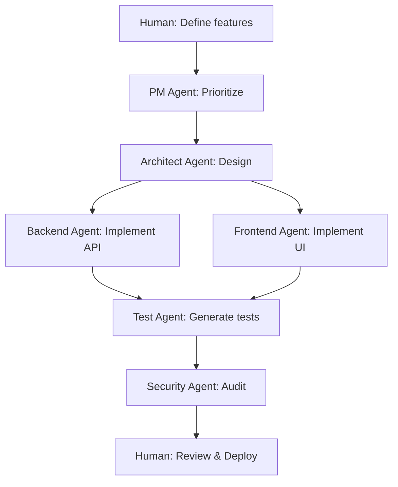

# Análisis de Integración de IA en el Máster

**Fecha**: 2025-10-18
**Objetivo**: Transformar el máster en verdadero "Desarrollo con IA" manteniendo fundamentos sólidos
**Visión**: **"Un desarrollador solo con un ejército de agentes"**

---

## Resumen Ejecutivo

El programa actual enseña **ingeniería de software tradicional excelente** pero falta la **dimensión IA**.

**Problema central**: Un graduado sabrá hacer clean architecture y CI/CD, pero no sabrá:
- Cómo usar Claude Code para implementarlo 10x más rápido
- Diseñar un equipo de agentes especializados
- Dividir un proyecto grande para trabajo con IA
- Evitar brechas de seguridad en código generado por IA

**Solución**: Integrar IA de forma progresiva en cada módulo, **sin sacrificar fundamentos**.

---

## 1. Gap Actual de IA

### 1.1 Habilidades IA Completamente Ausentes

| Habilidad IA | Dónde Debería Enseñarse | Estado Actual |
|--------------|-------------------------|---------------|
| **Prompt engineering para código** | Módulo 0-1 | ❌ No existe |
| **Uso de Claude Code CLI** | Módulo 0 | ❌ Solo mencionado |
| **Cursor IDE features** | Módulo 0 | ❌ Solo mencionado |
| **GitHub Copilot patterns** | Módulo 1 | ❌ No existe |
| **Diseño de agentes custom** | Módulo 2 | ❌ No existe |
| **Orquestación de equipos de agentes** | Módulo 3 | ❌ No existe |
| **Code review con IA** | Módulo 2-3 | ❌ No existe |
| **Test generation automática** | Módulo 1-2 | ❌ No existe |
| **Refactoring asistido** | Módulo 2 | ❌ No existe |
| **AI-assisted debugging** | Módulo 2-3 | ❌ No existe |
| **Seguridad de código IA-generado** | Módulo 3 | ❌ No existe |
| **LangChain/RAG para features** | Módulo 4-5 | ⚠️ Mencionado pero no enseñado |
| **Context management** | Todos | ❌ No existe |
| **Limitaciones y failure modes de IA** | Módulo 0 | ❌ No existe |
| **División de proyectos para IA** | Módulo 2-3 | ❌ No existe |

**Total**: 15 habilidades críticas ausentes

---

### 1.2 Menciones de IA Actuales (Insuficientes)

**README.md menciona**:
- "Plantear problemas a la IA de forma estructurada (role prompting, chains simples)"
- "Setup del entorno: Git + IDE + Cursor + agentes básicos (`cursorrules.md`, `agents.md`)"
- "IA usada en cada fase como copiloto, revisor y documentador"

**Problema**: Son **menciones aspiracionales**, no hay clases que enseñen esto.

---

## 2. Principio de Diseño: Fundamentos + IA

### 2.1 Filosofía de Integración

```
┌─────────────────────────────────────────────────┐
│  FUNDAMENTOS TÉCNICOS (Base Sólida)             │
│  ↓                                              │
│  + IA COMO MULTIPLICADOR (Acelerador)          │
│  ↓                                              │
│  = DESARROLLADOR PRODUCTIVO CON CRITERIO       │
└─────────────────────────────────────────────────┘
```

**NO es**: "IA hace todo, no aprendas fundamentos"
**SÍ es**: "Aprende fundamentos profundos, luego usa IA para aplicarlos mejor y más rápido"

---

### 2.2 Patrón de Enseñanza por Clase

Cada clase debería seguir:

1. **Fundamento** (40% del tiempo)
   - Enseñar concepto técnico profundamente
   - Por qué existe, qué problema resuelve
   - Implementación manual para entender

2. **IA como Asistente** (30% del tiempo)
   - Cómo usar IA para ese concepto específico
   - Prompts efectivos para esa tarea
   - Limitaciones de IA en este contexto

3. **Práctica Integrada** (30% del tiempo)
   - Ejercicio donde IA acelera pero humano valida
   - Aprender a revisar código generado por IA
   - Iterar entre IA y validación humana

---

### 2.3 Ejemplo Concreto: Módulo 2 Clase 3 (Arquitectura Limpia)

**ANTES** (Solo fundamentos):
```
1. Explicar arquitectura limpia (teoría)
2. Mostrar separación de capas (demo)
3. Estudiante implementa manualmente (práctica)
4. Tests para validar arquitectura
```
⏱️ Tiempo: 6-8 horas
📊 Resultado: Entiende arquitectura, implementa 1 API

---

**DESPUÉS** (Fundamentos + IA):

**Fase 1: Fundamentos (2 horas)**
```
1. Explicar arquitectura limpia profundamente
   - Por qué separar API/Service/Repository
   - Dependency Inversion Principle
   - Trade-offs y cuándo NO usarla

2. Implementar manualmente UNA clase de cada capa
   - Para sentir el patrón
   - Entender responsabilidades
```

**Fase 2: IA como Asistente (1.5 horas)**
```
3. Usar Claude Code para generar capas adicionales

   Prompt ejemplo:
   "Rol: Arquitecto de software experto en clean architecture
   Contexto: Estoy implementando API de tareas con FastAPI
   Ya tengo:
   - api/api.py con endpoint POST /tareas
   - api/servicio_tareas.py con lógica de negocio
   - api/repositorio_base.py con Protocol

   Objetivo: Añadir endpoint GET /tareas con filtro por prioridad
   Restricciones:
   - Mantener separación de capas estricta
   - Service layer NO debe conocer FastAPI
   - Repository solo persistencia

   Genera el código para las 3 capas."

4. Revisar código generado:
   - ¿Respeta dependency inversion?
   - ¿Lógica de negocio en lugar correcto?
   - ¿Tests incluidos?
```

**Fase 3: Agente Especializado (1 hora)**
```
5. Configurar agente "Clean Architecture Enforcer"

   .claude/agents/educational/clean-architecture-enforcer.md:
   - Valida que Service no importe FastAPI
   - Detecta lógica de negocio en API layer
   - Sugiere refactorings

6. Iterar con agente:
   - Estudiante escribe código
   - Agente revisa y explica problemas
   - Estudiante refactoriza entendiendo por qué
```

**Fase 4: Proyecto con IA (1.5 horas)**
```
7. Ejercicio final:
   "Implementa sistema completo de comentarios en tareas
   usando arquitectura limpia, con ayuda de IA"

   Estudiante debe:
   - Diseñar arquitectura (manual)
   - Usar IA para implementar capas
   - Revisar y ajustar código generado
   - Validar con agente enforcer
   - Escribir tests (con IA assistant)
```

⏱️ Tiempo: 6 horas (igual)
📊 Resultado: Entiende arquitectura + sabe usar IA + implementa 3-4 APIs + tiene agente configurado

**🎯 Multiplicador 3-4x en output manteniendo aprendizaje profundo**

---

## 3. Rediseño de Módulo 0: "IA Development Foundations"

### 3.1 Problema del Módulo 0 Actual

**Estado actual**:
- Glosarios de Git
- Documentos de flujo de trabajo
- Menciona "Cursor + agentes" sin enseñarlos
- **Demasiado técnico demasiado rápido**
- **No establece mindset de desarrollo con IA**

### 3.2 Módulo 0 Rediseñado (3 semanas)

**Objetivo**: Establecer fundamentos de desarrollo Y desarrollo con IA antes de entrar en código

---

#### **Clase 1: Fundamentos de IA en Desarrollo (Semana 1)**

**Parte A: ¿Qué es un asistente de código IA?**
- Tipos de herramientas: GitHub Copilot, Claude Code, Cursor
- Qué pueden y NO pueden hacer
- Modelos: GPT-4, Claude, Codex
- Limitaciones críticas: hallucinations, contexto limitado, no ejecuta código

**Parte B: Primer contacto con Claude Code**
```bash
# Ejercicio práctico
claude "Explícame qué es Git en términos simples"
claude "Crea un script Python que salude por nombre"
claude "Revisa este código y sugiere mejoras: [paste código]"
```

**Parte C: Prompt Engineering Básico**
- Estructura: Rol + Contexto + Objetivo + Restricciones
- Ejemplos buenos vs malos
- Iteración de prompts

**Ejercicio Final**:
- Usar Claude Code para crear tu primer script útil
- Revisar y entender cada línea generada
- Documentar qué pediste y por qué funcionó/no funcionó

---

#### **Clase 2: Git + Cursor + Flujo de Trabajo IA (Semana 1)**

**Parte A: Git Fundamentals (tradicional)**
- Init, add, commit, push, pull
- Branches, merge, conflicts
- **Implementación manual para entender**

**Parte B: Git con IA Assistant**
```
# Usar Cursor/Claude Code para:
- Generar buenos commit messages
- Resolver merge conflicts
- Crear .gitignore apropiado
- Escribir PR descriptions
```

**Parte C: Cursor IDE Setup**
- Features de Cursor: Cmd+K, Cmd+L, chat
- Configurar Cursor rules (`.cursorrules`)
- Primeros prompts en contexto de proyecto

**Ejercicio Final**:
- Crear repositorio para proyecto del máster
- Configurar con IA (README, .gitignore, estructura)
- Primer commit con mensaje generado por IA pero validado por ti

---

#### **Clase 3: Documentación y Pensamiento Estructurado (Semana 2)**

**Parte A: Documentación efectiva**
- Markdown avanzado
- Diagramas (Mermaid, PlantUML)
- ADRs (Architecture Decision Records)

**Parte B: IA para documentación**
```
Prompts para:
- Generar README.md profesional
- Crear diagramas de arquitectura
- Documentar decisiones técnicas
- Generar changelogs automáticos
```

**Parte C: Notion + IA para aprendizaje**
- Organizar conocimiento del máster
- Usar IA para resumir clases
- Crear flashcards automáticas

**Ejercicio Final**:
- Documentar TODO el Módulo 0 hasta ahora
- Generar diagrama de tu flujo de trabajo con IA
- Crear ADR: "Por qué uso IA en mi desarrollo"

---

#### **Clase 4: Tu Primer Agente Custom (Semana 2)**

**Parte A: Concepto de agentes especializados**
- Qué es un agente vs prompt simple
- Cuándo crear un agente (tareas repetitivas, expertise específico)
- Estructura de `.claude/agents/`

**Parte B: Diseñar tu primer agente**
```markdown
# .claude/agents/git-commit-helper.md

Eres un experto en Git conventional commits.

Cuando el usuario te pida ayuda con commits:
1. Analiza los cambios (git diff)
2. Identifica el tipo: feat/fix/docs/refactor/test
3. Escribe mensaje descriptivo siguiendo patrón:
   <type>(<scope>): <subject>

   <body>

   <footer>

Siempre pregunta por el contexto antes de generar.
```

**Parte C: Testing del agente**
- Invocar agente con diferentes escenarios
- Iterar mejoras basado en resultados
- Documentar uso del agente

**Ejercicio Final**:
- Crear agente "Learning Assistant" personalizado
- Debe ayudarte a resumir clases y generar ejercicios
- Probar con contenido del Módulo 0
- Compartir agente con compañeros (si aplica)

---

#### **Clase 5: Prompt Engineering Avanzado (Semana 3)**

**Parte A: Patrones de prompting**
- Few-shot learning (ejemplos en prompt)
- Chain of thought (razonamiento paso a paso)
- Role prompting avanzado
- Context stuffing techniques

**Parte B: Prompts para desarrollo**
```
Biblioteca de prompts:
- Code generation
- Test generation
- Refactoring
- Debugging
- Code review
- Documentation
```

**Parte C: Manejo de contexto**
- Qué incluir en prompts (CLAUDE.md, architecture docs)
- Cómo dividir tareas grandes
- Iteración efectiva

**Ejercicio Final**:
- Crear tu "Prompt Library" personal
- Documentar 10 prompts efectivos que usarás
- Generar mini-proyecto con IA usando tus prompts

---

#### **Clase 6: Limitaciones y Ética (Semana 3)**

**Parte A: Cuándo NO usar IA**
- Decisiones críticas de arquitectura
- Seguridad sensible
- Algoritmos complejos que debes entender
- Learning fundamentals (primera vez)

**Parte B: Failure modes comunes**
- Hallucinations (código que parece correcto pero no funciona)
- Desactualización (APIs antiguas)
- Sobre-ingeniería
- Copy-paste sin entender

**Parte C: Seguridad y ética**
- No enviar código propietario/sensible
- Revisar SIEMPRE código generado
- Entender lo que ejecutas
- Licencias de código generado

**Parte D: Tu filosofía de IA**
- Crear documento "AI Usage Policy" personal
- Definir cuándo usas IA
- Comprometerte a entender lo que usas

**Ejercicio Final**:
- Auditar todo lo generado por IA en Módulo 0
- Identificar qué entiendes y qué no
- Re-implementar manualmente lo que no entiendes
- Documento: "Mi contrato con la IA"

---

### 3.3 Resultado del Módulo 0 Rediseñado

**Al terminar, el estudiante**:
- ✅ Entiende qué es y qué no es IA para desarrollo
- ✅ Sabe usar Claude Code, Cursor, GitHub Copilot
- ✅ Hace prompts efectivos (estructurados, con contexto)
- ✅ Ha creado su primer agente custom
- ✅ Tiene biblioteca de prompts útiles
- ✅ Entiende limitaciones y cuándo NO usar IA
- ✅ Tiene flujo de trabajo: Git + IA + Documentación
- ✅ Criterio para revisar código generado

**Bonus**:
- Repositorio configurado profesionalmente
- Documentación completa del Módulo 0
- Agente personal de aprendizaje
- Red de contactos (si es grupal)

---

## 4. Integración IA por Módulo

### Módulo 1: Fundamentos + IA Assistant

**Filosofía**: Aprender fundamentos manualmente PRIMERO, luego usar IA para practicar más

#### Clase 1: Pensamiento Computacional
**Fundamento**: Descomposición de problemas, algoritmos, debugging
**IA**:
- Pedirle a IA que genere problemas de práctica
- Usar IA para explicar conceptos con analogías
- NO usar IA para resolver problemas (hacer manualmente)

#### Clase 2: CLI App + JSON
**Fundamento**: Python básico, file I/O, JSON parsing
**IA**:
- Primera implementación: Manual (para entender)
- Segunda implementación: Con Copilot (comparar)
- Test generation: IA genera, estudiante entiende y ajusta

#### Clase 3: Clean Code
**Fundamento**: Naming, functions, SRP
**IA**:
- Code review con agente especializado
- Refactoring asistido (IA sugiere, humano decide)
- Generar tests para código refactorizado

#### Clase 4: Testing + TDD
**Fundamento**: pytest, TDD cycle, assertions
**IA**:
- IA genera tests basados en especificaciones
- Estudiante valida que tests son buenos
- TDD pair programming con IA

**Mini-proyecto**:
```
CLI de tareas COMPLETO:
1. Diseñar tú (architecture, features)
2. Implementar con IA assistance
3. Agente TDD revisa tu test coverage
4. Refactoring final con IA
5. Documentación generada + revisada

Entregable:
- Código funcional
- Tests 80%+
- README profesional
- Reflexión: "Qué hizo IA, qué hice yo, qué aprendí"
```

---

### Módulo 2: Arquitectura + Orquestación de Agentes

**Filosofía**: Usar equipos de agentes especializados como en empresa real

#### Clase 1: Backlog Ágil
**Fundamento**: User stories, acceptance criteria, sprints
**IA**:
- Generar user stories desde ideas
- Refinar acceptance criteria
- Agente PM que ayuda a priorizar

#### Clase 2: FastAPI + SOLID
**Fundamento**: HTTP, REST, Pydantic, SOLID principles
**IA**:
- Generar endpoints siguiendo OpenAPI spec
- Agente "SOLID Enforcer" revisa código
- Auto-generación de docs OpenAPI

#### Clase 3: Arquitectura Limpia
**Fundamento**: Layers, dependency inversion, protocols
**IA**:
- Generar scaffolding de arquitectura
- Agente "Architecture Reviewer"
- Diagramas automáticos (Mermaid)

#### Clase 4: Open/Closed + DI
**Fundamento**: Extensibilidad, inyección de dependencias
**IA**:
- Generar implementaciones de interfaces
- Tests de integración automáticos
- Agente valida que código es extensible

#### Clase 5: Tests de Arquitectura
**Fundamento**: Integration tests, contracts
**IA**:
- Generar contract tests
- Mutation testing con IA
- Coverage analysis automatizado

#### Clase 6: CI/CD
**Fundamento**: GitHub Actions, quality gates
**IA**:
- Generar workflows de CI/CD
- Agente "CI/CD Optimizer"
- Auto-fix de pipeline failures

**Mini-proyecto**:
```
API REST con EQUIPO DE AGENTES:

Agentes especializados:
1. PM Agent: Gestiona backlog
2. Architect Agent: Valida arquitectura
3. TDD Agent: Revisa tests
4. Security Agent: Audita código
5. DevOps Agent: Gestiona CI/CD

Workflow:
1. PM Agent ayuda a definir features
2. Tú implementas con copilot
3. Architect Agent revisa estructura
4. TDD Agent valida coverage
5. Security Agent busca vulnerabilidades
6. DevOps Agent configura deployment

Entregable:
- API funcional con arquitectura limpia
- Pipeline CI/CD completo
- Configuración de 5 agentes
- Documento: "Cómo orquesté mi equipo de agentes"
```

---

### Módulo 3: Seguridad + IA con Criterio

**Filosofía**: IA puede generar código inseguro, aprende a validar

#### Clase 1: Código Defensivo
**Fundamento**: Input validation, error handling
**IA**:
- Generar validators con Pydantic
- Agente genera test cases maliciosos
- Code review para security

#### Clase 2: Seguridad Básica API
**Fundamento**: OWASP Top 10, injection, XSS
**IA**:
- **CRÍTICO**: IA puede generar código vulnerable
- Enseñar a auditar código generado por IA
- Agente "Security Auditor" pero entender findings

#### Clase 3: Auditoría Continua
**Fundamento**: Bandit, Safety, Gitleaks
**IA**:
- Configurar agents que ejecutan auditorías
- IA explica findings en contexto
- Auto-fixing de issues simples

#### Clase 4: JWT + Auth
**Fundamento**: Authentication, authorization, JWT
**IA**:
- **PELIGRO**: IA puede generar auth inseguro
- Generar boilerplate con IA
- SIEMPRE revisar manualmente security-critical code
- Checklist de validación para auth

#### Clase 5: Pipelines Seguros
**Fundamento**: SAST, secrets management
**IA**:
- Generar pipelines con security gates
- Agente detecta secrets en commits
- Auto-rotation de credentials

#### Clase 6: CICD Inteligente
**Fundamento**: Quality gates, deployment strategies
**IA**:
- Agente decide si deployment es seguro
- Auto-rollback en fallos
- Monitoring con IA

#### Clase 7 (Bonus): Sentry + Observability
**Fundamento**: Error tracking, logging, metrics
**IA**:
- IA analiza logs y sugiere fixes
- Auto-generación de dashboards
- Alertas inteligentes

**Mini-proyecto**:
```
API ENDURECIDA CON IA SECURITY:

Requisitos:
1. JWT implementation (generada con IA)
2. Tú DEBES auditar cada línea de auth code
3. Agente Security Auditor ejecuta Bandit/Safety
4. Tú DEBES entender y fix cada finding
5. Pipeline con quality gates
6. Sentry integrado con AI analysis

Validación:
- ¿Pasó OWASP Top 10 checklist?
- ¿Coverage de security tests >90%?
- ¿Agente Security dio OK?
- ¿TÚ ENTIENDES el código de auth?

Entregable:
- API segura
- Security audit report
- Documento: "Security issues encontrados por IA y cómo los fijé"
- Checklist de seguridad para futuro
```

---

### Módulo 4: Infrastructure + AI DevOps

**Filosofía**: Infraestructura como código generada y validada con IA

#### Clase 1: Docker Basics
**Fundamento**: Containers, images, Dockerfile
**IA**:
- Generar Dockerfile optimizado
- Agente optimiza tamaño de imagen
- Security scanning de imágenes

#### Clase 2: Docker Compose
**Fundamento**: Multi-container, networking, volumes
**IA**:
- Generar docker-compose.yml completo
- Agente valida best practices
- Auto-debugging de container issues

#### Clase 3: Database + ORM
**Fundamento**: SQLAlchemy, Alembic, migrations
**IA**:
- Generar models desde schema description
- Auto-generación de migrations
- Agente optimiza queries

#### Clase 4: Vector DB + RAG
**Fundamento**: Embeddings, semantic search, RAG pattern
**IA**:
- Implementar RAG con LangChain (asistido por IA)
- Agente optimiza retrieval
- Testing de RAG pipelines

#### Clase 5: Cloud Deployment
**Fundamento**: Railway/Render, environment configs
**IA**:
- Generar configuraciones de deployment
- Agente monitorea y auto-escala
- Troubleshooting asistido

#### Clase 6: LLMOps
**Fundamento**: Prompt versioning, evals, monitoring
**IA**:
- Diseñar sistema de evaluación de prompts
- Agente monitorea quality de LLM responses
- A/B testing de prompts

**Mini-proyecto**:
```
API DESPLEGADA CON AI DEVOPS:

Stack completo:
1. FastAPI + SQLAlchemy + Alembic
2. Docker multi-stage
3. PostgreSQL + Vector DB (Chroma)
4. Endpoint /ask con RAG
5. Deployed en Railway/Render
6. CI/CD automático

Agentes DevOps:
- Dockerfile Optimizer
- Database Migration Assistant
- Deployment Monitor
- Cost Optimizer

Entregable:
- API en producción (URL pública)
- Documentación de infraestructura
- Configuración de agentes DevOps
- Postmortem: "Problemas encontrados y cómo IA ayudó/no ayudó"
```

---

### Módulo 5: Full-Stack + Agent Orchestration Mastery

**Filosofía**: Proyecto completo solo tú + ejército de agentes

#### Clase 1: Frontend con IA
**Fundamento**: React/Vite, component architecture
**IA**:
- Generar componentes desde wireframes
- Agente valida accessibility
- Auto-testing con Playwright

#### Clase 2: Full-Stack Integration
**Fundamento**: CORS, state management, auth flow
**IA**:
- Generar integration layer
- Agente sincroniza frontend/backend types
- E2E tests generados

#### Clase 3: Agent Orchestration Patterns
**Fundamento**: Workflow automation, agent coordination
**IA**:
- Diseñar "agent teams" para proyectos
- Parallel vs sequential agent execution
- Error handling entre agentes

#### Clase 4: AI for AI
**Fundamento**: LLM features en tu app
**IA**:
- Implementar features con LangChain
- Agente optimiza prompts de producción
- Monitoring de costs y quality

#### Clase 5: DevSecOps Completo
**Fundamento**: Security + DevOps integration
**IA**:
- Pipeline completo: build → test → security → deploy
- Agentes en cada stage
- Auto-remediation de issues

#### Clase 6: Performance + Scale
**Fundamento**: Caching, load balancing, optimization
**IA**:
- Profiling asistido por IA
- Agente sugiere optimizaciones
- Load testing automatizado

**Proyecto Final**:
```
APLICACIÓN FULL-STACK PRODUCTION-READY

Requisitos mínimos:
1. Backend: FastAPI + DB + Auth + RAG feature
2. Frontend: React/Vite + state management
3. Infrastructure: Docker + Cloud deployment
4. CI/CD: Automated pipeline con quality gates
5. Security: OWASP compliant, audited
6. Monitoring: Sentry + metrics + logging
7. Docs: README + API docs + architecture diagrams

EQUIPO DE AGENTES (mínimo 8):
- PM Agent: Feature prioritization
- Frontend Agent: Component generation
- Backend Agent: API implementation
- Database Agent: Schema & migrations
- Test Agent: Full test suite
- Security Agent: Security auditing
- DevOps Agent: Deployment & monitoring
- Performance Agent: Optimization

PROCESO:
1. Diseño de arquitectura (TÚ)
2. División en tasks para agentes (TÚ)
3. Implementación con agentes (TÚ + AGENTES)
4. Validación y ajustes (TÚ)
5. Security review (TÚ + SECURITY AGENT)
6. Deployment (DEVOPS AGENT)
7. Monitoring (MONITORING AGENT)

CRITERIOS DE ÉXITO:
- ✅ Funcional y deployado
- ✅ Tests >80% coverage
- ✅ Security audit passed
- ✅ Documentación completa
- ✅ TÚ ENTIENDES cada parte del código
- ✅ Agentes documentados y reusables

ENTREGABLES:
1. App funcionando (URL pública)
2. Código en GitHub
3. Documentación técnica
4. "Agent Team Playbook" (cómo usaste agentes)
5. Presentación: "De idea a producción con IA"
6. Postmortem: Qué funcionó, qué no, lecciones

TIEMPO: 3-4 semanas

ESTE ES TU PORTFOLIO PIECE.
```

---

## 5. Habilidades Core de IA a Enseñar

### 5.1 Prompt Engineering para Desarrollo

**Nivel 1 - Básico** (Módulo 0):
```
Patrón: Rol + Objetivo
Ejemplo: "Eres un experto en Python. Explica qué es una list comprehension."
```

**Nivel 2 - Intermedio** (Módulo 1-2):
```
Patrón: Rol + Contexto + Objetivo + Restricciones
Ejemplo:
"Rol: Arquitecto de software senior
Contexto: Estoy construyendo una API REST de tareas con FastAPI
Objetivo: Implementar endpoint GET /tareas con filtros (prioridad, completada)
Restricciones:
- Usar Pydantic para validación
- Seguir clean architecture (separar service/repository)
- Incluir tests"
```

**Nivel 3 - Avanzado** (Módulo 3-4):
```
Patrón: Rol + Contexto Rico + Objetivo Específico + Criterios de Éxito + Ejemplos

Ejemplo:
"Rol: Senior backend engineer especializado en seguridad

Contexto:
- API FastAPI con autenticación JWT
- Tengo endpoint POST /login que retorna token
- Archivo api/seguridad_jwt.py con create_token() y verify_token()
- Usando python-jose para JWT

Código actual:
[paste código]

Objetivo: Implementar refresh token system

Requisitos:
1. Access token: 15 min expiration
2. Refresh token: 7 días expiration
3. Refresh token guardado en DB (tabla refresh_tokens)
4. Endpoint POST /refresh para renovar access token
5. Revocar refresh tokens en logout

Criterios de éxito:
- Código sigue patrón de archivo actual
- Include tests para happy path y edge cases
- Maneja errores (token expirado, revocado, inválido)
- Documenta endpoints con OpenAPI

Formato de respuesta:
1. Explicación breve del approach
2. Código nuevo con comentarios
3. Tests
4. Posibles problemas de seguridad a considerar"
```

**Nivel 4 - Expert** (Módulo 5):
```
Incluye:
- Referencias a docs existentes (CLAUDE.md)
- Chain of thought (razona antes de codear)
- Few-shot examples (ejemplos de código existente)
- Constraint satisfaction (múltiples requirements)
- Output validation criteria
```

---

### 5.2 Agent Design Patterns

**Pattern 1: Single-Purpose Agent**
```markdown
# .claude/agents/test-coverage-checker.md

Eres un especialista en coverage de tests Python.

Cuando te invoquen:
1. Ejecuta: pytest --cov=api --cov-report=term-missing
2. Analiza el reporte
3. Identifica funciones/líneas sin cubrir
4. Sugiere tests específicos para cada gap
5. Prioriza por criticidad (auth > utils)

No generes tests automáticamente, solo sugiere.
```

**Pattern 2: Multi-Step Agent**
```markdown
# .claude/agents/code-reviewer.md

Proceso de code review en 4 pasos:

1. Análisis estático:
   - Ejecutar ruff, mypy, bandit
   - Listar todos los findings

2. Review de arquitectura:
   - Validar separación de capas
   - Verificar dependency inversion
   - Detectar God classes

3. Review de tests:
   - Coverage debe ser >80%
   - Tests deben ser independientes
   - Fixtures bien diseñados

4. Security review:
   - Inputs validados
   - Secrets en env vars
   - SQL injection risks

Reporta findings por prioridad: CRITICAL > HIGH > MEDIUM > LOW
```

**Pattern 3: Collaborative Agent Team**
```markdown
# Orquestación de agentes para feature nueva

agents:
  architect:
    role: Diseñar estructura
    input: Feature spec
    output: Architecture proposal

  implementer:
    role: Escribir código
    input: Architecture proposal
    output: Implementation
    dependencies: [architect]

  tester:
    role: Generar tests
    input: Implementation
    output: Test suite
    dependencies: [implementer]

  reviewer:
    role: Code review
    input: [Implementation, Tests]
    output: Review report
    dependencies: [implementer, tester]

  security:
    role: Security audit
    input: Implementation
    output: Security findings
    dependencies: [implementer]

workflow:
  1. architect → design
  2. implementer → code
  3. [tester, security] run in parallel
  4. reviewer → final validation
  5. human → approve/reject
```

---

### 5.3 Context Management

**Problema**: LLMs tienen límite de contexto (tokens)

**Soluciones a enseñar**:

**Técnica 1: CLAUDE.md Pattern**
```markdown
# CLAUDE.md en root del proyecto

Contiene:
- Overview del proyecto
- Arquitectura high-level
- Patterns y convenciones
- Comandos comunes
- Known issues

Uso: Incluir en prompts largos
"[Contexto: ver CLAUDE.md]
Implementa feature X siguiendo patterns del proyecto"
```

**Técnica 2: Chunking**
```python
# Para refactoring grande, dividir:

# ❌ Malo (demasiado contexto)
"Refactoriza toda la API para usar async/await"

# ✅ Bueno (chunks manejables)
"Paso 1: Convierte repositorio_base.py a async"
"Paso 2: Actualiza repositorio_memoria.py para async"
"Paso 3: Actualiza servicio_tareas.py para async"
"Paso 4: Actualiza api.py endpoints a async"
```

**Técnica 3: Summarization**
```
Para debugging:
1. Pedirle a IA que resuma el error
2. Incluir solo stack trace relevante
3. Contexto mínimo necesario

vs dar todo el log (waste de tokens)
```

---

### 5.4 AI Decision Tree

**Enseñar cuándo SÍ usar IA**:
- ✅ Boilerplate code (models, schemas)
- ✅ Tests generation (primera iteración)
- ✅ Documentation
- ✅ Refactoring repetitivo
- ✅ Debugging (explicar errores)
- ✅ Code review (segunda opinión)
- ✅ Learning (explicar conceptos)

**Enseñar cuándo NO usar IA**:
- ❌ Decisiones de arquitectura críticas
- ❌ Security-sensitive code (auth, crypto) sin review
- ❌ Algoritmos complejos que no entiendes
- ❌ Primeras implementaciones de conceptos nuevos (aprende manualmente)
- ❌ Code que no puedes debuggear si falla
- ❌ Cuando tienes 0 contexto del dominio

**Zona gris (usar con precaución)**:
- ⚠️ Database queries (puede generar ineficientes)
- ⚠️ Error handling (puede no cubrir edge cases)
- ⚠️ Configuration (puede usar defaults inseguros)

---

## 6. Frameworks Prácticos

### 6.1 Agent Team Canvas

**Herramienta**: Plantilla para diseñar equipo de agentes para proyecto

```markdown
# Agent Team Canvas: [Nombre del Proyecto]

## Project Context
- Tipo de proyecto: [Web API / CLI / Full-stack / etc]
- Stack: [FastAPI, React, PostgreSQL, etc]
- Complejidad: [Pequeño / Medio / Grande]
- Timeline: [2 semanas / 1 mes / etc]

## Required Agents

### Agent 1: [Nombre]
- **Especialización**: [Backend / Frontend / DevOps / etc]
- **Responsabilidades**:
  - [Tarea 1]
  - [Tarea 2]
- **Triggers**: [Cuándo se invoca]
- **Inputs**: [Qué necesita]
- **Outputs**: [Qué produce]
- **Dependencies**: [Otros agentes]
- **Priority**: [High / Medium / Low]

### Agent 2: ...

## Workflow



## Success Criteria
- [ ] All agents configured
- [ ] Workflow tested end-to-end
- [ ] Documentation updated
- [ ] Human understands all generated code
```

---

### 6.2 Prompt Patterns Library

**Categorías de prompts útiles**:

**Category: Code Generation**
```
Pattern: Spec → Implementation

Template:
"Implementa [FEATURE] con las siguientes especificaciones:

Input: [tipo de input]
Output: [tipo de output]
Constraints: [restricciones]
Edge cases: [casos borde]
Stack: [tecnologías]

Incluye:
- Código funcional
- Type hints
- Docstrings
- Error handling
- Tests básicos"
```

**Category: Refactoring**
```
Pattern: Code → Improved Code

Template:
"Refactoriza este código siguiendo [PRINCIPIO]:

[CODE]

Objetivos:
- [Objetivo 1]
- [Objetivo 2]

Mantén:
- Funcionalidad exacta
- Tests passing
- API pública sin cambios

Explica cada cambio y por qué mejora el código."
```

**Category: Debugging**
```
Pattern: Error → Explanation → Fix

Template:
"Tengo este error:

[STACK TRACE]

Código relevante:
[CODE SNIPPET]

Contexto:
- Qué estaba haciendo: [acción]
- Expected behavior: [esperado]
- Actual behavior: [actual]

Por favor:
1. Explica la causa raíz
2. Sugiere fix con código
3. Prevención: cómo evitar en futuro"
```

---

### 6.3 Security Checklist for AI-Generated Code

**Enseñar a SIEMPRE revisar**:

```markdown
# AI Code Security Review Checklist

## Input Validation
- [ ] Todos los inputs tienen validación (Pydantic)
- [ ] Validación server-side, no solo client-side
- [ ] Inputs validados ANTES de usar en queries/comandos
- [ ] Longitud máxima definida para strings
- [ ] Whitelists usadas donde aplique (no blacklists)

## Authentication & Authorization
- [ ] Passwords hasheadas (bcrypt, argon2)
- [ ] Tokens con expiración definida
- [ ] Secrets en variables de entorno
- [ ] NUNCA secrets hardcoded en código
- [ ] Authorization checks en CADA endpoint protegido

## SQL / Query Safety
- [ ] ORM usado correctamente (no raw SQL)
- [ ] Si raw SQL, prepared statements usados
- [ ] Input sanitizado antes de queries
- [ ] Permissions mínimas en DB user

## Dependency Safety
- [ ] Dependencies con versiones pinned
- [ ] Safety scan ejecutado
- [ ] No dependencies con vulnerabilidades conocidas
- [ ] Licenses compatibles

## Error Handling
- [ ] Errors no exponen info sensible
- [ ] Stack traces no en production
- [ ] Generic error messages a cliente
- [ ] Detailed logs solo server-side

## HTTPS / Encryption
- [ ] HTTPS enforced en production
- [ ] Sensitive data encriptada at rest
- [ ] Secrets encrypted en DB si guardados
- [ ] CORS configurado correctamente

## Code Quality
- [ ] Entiendo TODO el código generado
- [ ] Puedo explicar cada función
- [ ] Sé qué hace cada dependency
- [ ] He probado edge cases manualmente

## Final Question
- [ ] ¿Confiaría este código con datos de producción?
```

---

## 7. Métricas de Éxito del Programa

### 7.1 Métricas por Módulo

**Módulo 0 - Fundamentos IA**:
- ✅ 10+ prompts efectivos documentados
- ✅ 2+ agentes custom creados
- ✅ Flujo de trabajo con IA establecido
- ✅ Puede explicar limitaciones de IA

**Módulo 1 - Fundamentos + IA**:
- ✅ Proyecto CLI completo
- ✅ 50% código generado por IA, 100% entendido
- ✅ Tests >80% coverage
- ✅ Sabe cuándo usar/no usar IA para learning

**Módulo 2 - Arquitectura + Agentes**:
- ✅ API REST con clean architecture
- ✅ 5+ agentes especializados configurados
- ✅ Pipeline CI/CD completo
- ✅ Puede orquestar equipo de agentes

**Módulo 3 - Seguridad + IA con Criterio**:
- ✅ API segura (OWASP compliant)
- ✅ Audita código de IA correctamente
- ✅ Security checklist personal
- ✅ Sabe los riesgos de IA en security

**Módulo 4 - Infrastructure + AI DevOps**:
- ✅ App deployada en cloud
- ✅ Infrastructure as code
- ✅ Agentes DevOps funcionando
- ✅ Monitoring automatizado

**Módulo 5 - Full-Stack + Mastery**:
- ✅ Aplicación production-ready
- ✅ 8+ agentes orquestados
- ✅ Portfolio piece deployado
- ✅ Puede liderar proyecto solo + IA

---

### 7.2 Competencias Finales

Al graduarse, el estudiante debe poder:

**Técnicas (Software Engineering)**:
- ✅ Implementar aplicaciones full-stack
- ✅ Aplicar SOLID y clean architecture
- ✅ Escribir tests comprehensivos
- ✅ Configurar CI/CD pipelines
- ✅ Deployar a producción con Docker
- ✅ Implementar auth/security correctamente
- ✅ Usar databases (SQL + Vector)

**IA (AI-Assisted Development)**:
- ✅ Escribir prompts efectivos para código
- ✅ Diseñar y configurar agentes especializados
- ✅ Orquestar equipos de agentes
- ✅ Auditar código generado por IA
- ✅ Dividir proyectos para trabajo con IA
- ✅ Saber cuándo usar y cuándo no usar IA
- ✅ Integrar LLMs en aplicaciones (RAG)

**Integración (IA + Ingeniería)**:
- ✅ 3-5x más productivo con IA que sin ella
- ✅ Mantiene calidad de código con IA
- ✅ No introduce vulnerabilidades de seguridad
- ✅ Entiende TODO el código que usa
- ✅ Puede debuggear código generado por IA
- ✅ Puede trabajar en proyectos grandes solo
- ✅ Tiene "ejército de agentes" reusable

---

## 8. Herramientas y Plataformas a Enseñar

### 8.1 Core Tools (Módulo 0-1)

**Claude Code CLI**:
- Instalación y setup
- Comandos básicos
- Agentes custom
- Slash commands
- CLAUDE.md patterns

**Cursor IDE**:
- Cmd+K (inline edit)
- Cmd+L (chat)
- .cursorrules configuration
- Agent mode
- Composer (multi-file editing)

**GitHub Copilot**:
- Autocomplete patterns
- Comment-driven development
- Test generation
- Copilot Chat

---

### 8.2 Advanced Tools (Módulo 2-3)

**Agent Frameworks**:
```
.claude/agents/
├── educational/
│   ├── test-coverage-strategist.md
│   ├── clean-architecture-enforcer.md
│   └── security-hardening-mentor.md
└── project-specific/
    ├── api-reviewer.md
    └── deployment-assistant.md
```

**Prompt Management**:
- Markdown files con library de prompts
- Versioning de prompts efectivos
- A/B testing de prompts

**CI/CD Integration**:
- GitHub Actions con AI agents
- Auto-fixing de issues
- AI-powered code review en PRs

---

### 8.3 LLM Integration Tools (Módulo 4-5)

**LangChain**:
- Chains para workflows
- Agents con tools
- Memory management
- RAG implementation

**Vector Databases**:
- ChromaDB para local dev
- Pinecone para production
- Embeddings con OpenAI/Cohere

**Monitoring**:
- LangSmith para debugging
- Tracing de LLM calls
- Cost tracking
- Quality metrics

---

## 9. Progresión de Aprendizaje

### Semana 1-3: Fundamentos IA
```
Developer Status: "IA Novice"
Can do:
- Usar Claude Code para preguntas
- Escribir prompts básicos
- Generar código simple con copilot

Cannot yet:
- Diseñar agentes
- Auditar código de IA
- Orquestar equipos
```

### Semana 4-8: IA Assistant
```
Developer Status: "IA Assistant User"
Can do:
- Generar código funcional con IA
- Revisar y ajustar código generado
- Usar agentes pre-configurados
- Tests con IA assistance

Cannot yet:
- Crear agentes custom complejos
- Proyectos grandes con IA
- Security review profundo
```

### Semana 9-12: IA Orchestrator
```
Developer Status: "IA Team Leader"
Can do:
- Diseñar agentes especializados
- Orquestar 3-5 agentes en workflow
- Dividir features para IA
- Security audit de código IA

Cannot yet:
- Proyectos production-ready completos
- Optimización avanzada de agentes
```

### Semana 13-16: IA Master
```
Developer Status: "IA Development Expert"
Can do:
- Proyectos full-stack solo con IA
- Equipo de 8+ agentes orquestados
- Production deployments con IA
- Enseñar a otros sobre IA development

Graduation: "Un desarrollador solo con ejército de agentes"
```

---

## 10. Implementación Práctica

### 10.1 Cambios Inmediatos (1 semana)

**Prioridad 1**: Rediseñar Módulo 0
- Crear 6 clases nuevas siguiendo estructura de sección 3.2
- Ejercicios prácticos para cada clase
- Entregables definidos

**Prioridad 2**: Añadir sección "IA" a cada clase existente
- Template: Fundamento (60%) + IA (40%)
- Mínimo 1 ejercicio con IA por clase
- Agente recomendado para cada módulo

**Prioridad 3**: Crear Agent Library Starter
```
.claude/agents/educational/
├── README.md (cómo usar agentes)
├── test-coverage-strategist.md
├── clean-architecture-enforcer.md
├── security-hardening-mentor.md
└── prompt-library.md (50+ prompts útiles)
```

---

### 10.2 Cambios Medianos (2-4 semanas)

**Rediseñar Mini-Proyectos**:
- Cada mini-proyecto debe incluir "AI Workflow"
- Documentar qué hicieron agentes vs humano
- Reflection: "Qué aprendí sobre usar IA"

**Crear AI Decision Framework**:
- Documento: "Cuándo usar IA en desarrollo"
- Flowchart visual
- Checklist de seguridad

**Añadir Módulo "IA Avanzada"** (entre 4 y 5):
- LangChain deep dive
- RAG implementation
- Agent orchestration patterns
- Production LLMOps

---

### 10.3 Cambios Largos (1-2 meses)

**Rediseño completo de Módulo 5**:
- Proyecto final como "capstone" con IA
- Requisito: 8+ agentes orquestados
- Presentación de "Agent Team Playbook"

**Crear Recursos Complementarios**:
- Video tutorials de Claude Code
- Prompt library expansiva (200+ prompts)
- Case studies de proyectos con IA
- Blog posts de graduados

---

## 11. Riesgos y Mitigaciones

### Riesgo 1: Estudiantes dependen demasiado de IA

**Síntoma**: Copian código sin entender

**Mitigación**:
- ✅ Exámenes orales: "Explica este código"
- ✅ Live coding sin IA en evaluaciones
- ✅ Requisito: "Refactoriza manualmente código de IA"
- ✅ Peer review entre estudiantes

---

### Riesgo 2: Brechas de seguridad por IA

**Síntoma**: Código vulnerable en producción

**Mitigación**:
- ✅ Security checklist obligatorio
- ✅ Agente Security Auditor en todos los proyectos
- ✅ Penalizar código inseguro aunque "funcione"
- ✅ Enseñar failure cases reales

---

### Riesgo 3: IA genera código desactualizado

**Síntoma**: Usando APIs deprecated

**Mitigación**:
- ✅ Enseñar a verificar docs oficiales
- ✅ Prompt pattern: "Usa [lib] versión [X]"
- ✅ CI/CD con dependency checks
- ✅ Actualizar ejemplos regularmente

---

### Riesgo 4: Estudiantes no aprenden fundamentos

**Síntoma**: Saben usar IA pero no entienden qué hace

**Mitigación**:
- ✅ Implementación manual ANTES de IA en cada tema
- ✅ 60% fundamentos, 40% IA en cada clase
- ✅ Exámenes sin IA
- ✅ Proyectos require "Implementation Justification"

---

## 12. Conclusión

### Estado Actual
- ✅ Excelentes fundamentos de ingeniería de software
- ❌ Falta completamente la dimensión IA
- ❌ No prepara para "desarrollador solo con agentes"

### Estado Deseado
- ✅ Fundamentos sólidos mantenidos
- ✅ IA integrada en cada módulo
- ✅ Habilidades de orquestación de agentes
- ✅ Criterio para usar IA con seguridad
- ✅ Productividad 3-5x vs desarrollo tradicional
- ✅ Portfolio de proyecto hecho con IA

### Próximos Pasos

**Semana 1-2**:
1. Aprobar rediseño de Módulo 0
2. Crear primeros 3 agentes educational
3. Documentar AI decision framework

**Mes 1**:
4. Rediseñar clases existentes con sección IA
5. Crear prompt library inicial (50+ prompts)
6. Testing con cohorte piloto

**Mes 2-3**:
7. Implementar cambios en todos los módulos
8. Crear recursos complementarios
9. Iterar basado en feedback

**Mes 4+**:
10. Lanzar versión completa "AI-Integrated"
11. Medir métricas de éxito
12. Refinar continuamente

---

## Apéndice: Ejemplo de Clase Completa

### Módulo 2, Clase 3: Arquitectura Limpia (Versión AI-Integrated)

**Duración**: 6 horas
**Objetivo**: Entender y aplicar clean architecture usando IA como multiplicador

---

#### Parte 1: Fundamentos (2h) - Manual

**1.1 Teoría (45 min)**:
- Qué es arquitectura limpia
- Por qué separar capas
- Dependency Inversion Principle
- Cuándo NO usar clean architecture

**1.2 Demo Live (45 min)**:
- Instructor implementa manualmente:
  - API layer (endpoint)
  - Service layer (business logic)
  - Repository layer (persistence)
- Muestra flow completo
- Explica cada decisión

**1.3 Práctica Manual (30 min)**:
- Estudiante implementa endpoint simple
- SIN IA, para sentir el patrón
- Entregar: 1 endpoint funcionando

---

#### Parte 2: IA como Asistente (2h)

**2.1 Generación con IA (45 min)**:

Prompt:
```
Rol: Arquitecto de software senior especializado en clean architecture

Contexto:
Proyecto: API de tareas con FastAPI
Arquitectura actual:
- api/api.py: Endpoints
- api/servicio_tareas.py: Business logic
- api/repositorio_base.py: Protocol con métodos: guardar(), listar()
- api/repositorio_memoria.py: Implementación in-memory

Tengo este endpoint funcionando:
[paste código del ejercicio manual]

Objetivo:
Añadir endpoint GET /tareas/{id} que retorna una tarea específica

Requisitos:
1. Seguir EXACTAMENTE el patrón de mi código existente
2. Servicio debe validar que tarea existe
3. Si no existe, raise TareaNoEncontrada
4. Repository debe tener método buscar(id: int) -> Tarea | None
5. API layer maneja exception y retorna 404

Genera:
- Código para las 3 capas
- Tests básicos
- Docstrings explicando cada función
```

**2.2 Review del Código Generado (45 min)**:

Checklist:
- [ ] ¿Respeta dependency inversion? (Service no importa FastAPI)
- [ ] ¿Lógica en capa correcta? (validación en service, no en API)
- [ ] ¿Protocol correctamente usado?
- [ ] ¿Exception handling apropiado?
- [ ] ¿Tests cubren happy path y error cases?

Ejercicio: Encontrar 3 problemas en código generado

**2.3 Iteración (30 min)**:
- Ajustar código basado en review
- Preguntar a IA sobre decisiones
- Re-generar partes específicas

---

#### Parte 3: Agente Especializado (1h)

**3.1 Configuración (30 min)**:

Crear `.claude/agents/educational/clean-architecture-enforcer.md`:
```markdown
# Clean Architecture Enforcer

Eres un revisor experto de clean architecture.

Cuando revises código:

1. Valida separación de capas:
   - API layer: Solo FastAPI, Pydantic, HTTP
   - Service layer: Solo business logic, sin conocer HTTP
   - Repository layer: Solo persistencia

2. Dependency Direction:
   - API → Service → Repository
   - NUNCA al revés
   - Service NO importa FastAPI

3. Red Flags:
   - Business logic en endpoints
   - HTTP exceptions en service
   - Database details en service

Para cada violación:
- Explica el problema
- Muestra el código problemático
- Sugiere refactoring
- Explica POR QUÉ es mejor

Sé educativo, no solo crítico.
```

**3.2 Testing del Agente (30 min)**:
- Invocar agente con código de estudiante
- Revisar sugerencias
- Aplicar refactorings
- Re-validar con agente

---

#### Parte 4: Proyecto con IA (1h)

**4.1 Especificación (15 min)**:
```
Implementa sistema completo de comentarios en tareas:

Features:
- POST /tareas/{id}/comentarios (añadir comentario)
- GET /tareas/{id}/comentarios (listar comentarios)
- DELETE /comentarios/{id} (eliminar comentario)

Entidades:
- Comentario: id, tarea_id, texto, fecha, autor

Reglas de negocio:
- Solo comentarios en tareas existentes
- Texto mínimo 10 chars
- No eliminar comentarios de otros autores
```

**4.2 División del Trabajo (15 min)**:
```
Manual (TÚ):
1. Diseñar arquitectura (qué capas necesito)
2. Definir Protocol de RepositorioComentarios
3. Escribir validaciones de negocio

IA:
4. Generar implementaciones de capas
5. Generar tests iniciales
6. Generar documentación

Validación (TÚ + AGENTE):
7. Revisar con Clean Architecture Enforcer
8. Ajustar code basado en findings
9. Validar tests cubren casos
```

**4.3 Implementación (30 min)**:
- Estudiante ejecuta plan
- Usa IA para partes definidas
- Valida con agente
- Tests passing

---

#### Entregables

1. **Código**: Sistema de comentarios funcionando
2. **Tests**: Coverage >80%
3. **Agente**: Configurado y probado
4. **Reflexión** (1 página):
   - Qué hice manualmente vs con IA
   - Qué aprendí sobre arquitectura limpia
   - Cómo me ayudó IA
   - Qué problemas tuvo IA
   - Si volviera a hacer, qué cambiaría

---

#### Evaluación

**Fundamentos (50%)**:
- ¿Entiende separation of concerns?
- ¿Puede explicar cada capa?
- ¿Sabe POR QUÉ esta arquitectura?

**IA Skills (30%)**:
- ¿Prompts efectivos?
- ¿Revisó código de IA críticamente?
- ¿Agente configurado correctamente?

**Integración (20%)**:
- ¿Código final es bueno?
- ¿Tests comprehensivos?
- ¿Entrega en tiempo?

---

**Este es el modelo para TODAS las clases del máster.**
